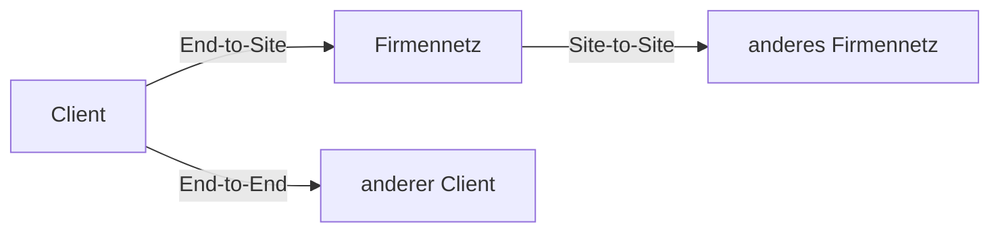

---
# Identity (stable; never change after publishing)
id: ap1-0268
slug: vpn-verbindungsarten

# Display
title: "VPN-Verbindungsarten"

# Classification / navigation (machine-side)
module: "Entwickeln, Erstellen und Betreuen von IT_Lösungen"
topics: ["Netzwerk", "VPN", "Sicherheit"]
tags: ["ap1", "vpn", "netzwerk", "sicherheit"]

# Flashcard payload
card:
  type: basic       # basic | multi | steps | definition | comparison
  question: "Führe die 3 VPN-Verbindungsarten auf."
  answer: "End-to-Site (Host-to-LAN / Remote Access), Site-to-Site (LAN-to-LAN / Gateway-to-Gateway) und End-to-End (Host-to-Host)."
  examples: ["Homeoffice-Zugriff per Remote Access VPN", "Verbindung zweier Firmenstandorte"]

# Lifecycle
status: published       # draft | published | deprecated
created: "2026-03-18"
updated: "2026-03-18"
---

## VPN-Verbindungsarten
VPN (Virtual Private Network) ermöglicht eine **sichere Verbindung über unsichere Netzwerke** wie das Internet.

Es gibt drei grundlegende Verbindungsarten.

## Kernerklärung

### 1. End-to-Site (Remote Access VPN)
- Verbindung:
  - einzelner Client → Netzwerk (LAN)
- auch genannt:
  - Host-to-LAN  
  - Host-to-Gateway  

- Einsatz:
  - Homeoffice  
  - mobiler Zugriff  

---

### 2. Site-to-Site VPN
- Verbindung:
  - Netzwerk → Netzwerk  
- auch genannt:
  - LAN-to-LAN  
  - Gateway-to-Gateway  

- Einsatz:
  - Verbindung von Firmenstandorten  

---

### 3. End-to-End VPN
- Verbindung:
  - einzelner Host → einzelner Host  
- auch genannt:
  - Host-to-Host  
  - Remote-Desktop-VPN  

- Einsatz:
  - direkte, gesicherte Kommunikation zwischen zwei Geräten  

## Praktisches Beispiel

- End-to-Site:
  - Mitarbeiter verbindet sich von zuhause ins Firmennetz  

- Site-to-Site:
  - Hauptstandort ↔ Außenstelle  

- End-to-End:
  - sichere Verbindung zwischen zwei Rechnern  

## Prüfungsrelevanz (AP1)

### Typische Prüfungsfragen
- Nenne die 3 VPN-Arten  
- Unterschied zwischen Site-to-Site und Remote Access  
- Wo wird welche Art eingesetzt?  

### Antworten auf die typischen Prüfungsfragen
- End-to-Site, Site-to-Site, End-to-End  
- Site-to-Site = Netzwerke, Remote = einzelner Nutzer  
- Homeoffice vs. Standortvernetzung  

## Merksatz
VPN verbindet entweder Nutzer, Netzwerke oder einzelne Geräte sicher über das Internet.