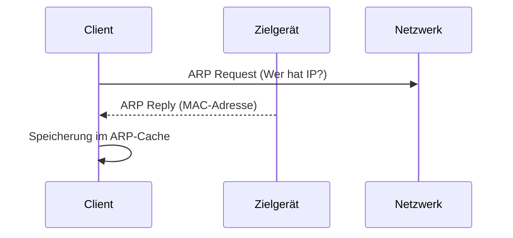

---
# Identity (stable; never change after publishing)
id: ap1-0271
slug: arp-adressauflösung-protokoll

# Display
title: "ARP – Address Resolution Protocol"

# Classification / navigation (machine-side)
module: "Entwickeln, Erstellen und Betreuen von IT_Lösungen"
topics: ["Netzwerk", "Protokolle", "OSI-Modell"]
tags: ["ap1", "arp", "netzwerk", "ip", "mac"]

# Flashcard payload
card:
  type: basic       # basic | multi | steps | definition | comparison
  question: "Welches Befehlszeilenkommando ist im Bild zu sehen und wie funktioniert das zugehörige Protokoll?"
  answer: "Befehl: arp. ARP ordnet einer IP-Adresse die physische MAC-Adresse zu und speichert diese Zuordnung im ARP-Cache."
  examples: ["arp -a", "Anzeige der ARP-Tabelle"]

# Lifecycle
status: published       # draft | published | deprecated
created: "2026-03-18"
updated: "2026-03-18"
---

## ARP – Address Resolution Protocol
Das **Address Resolution Protocol (ARP)** wird in Netzwerken verwendet, um **IP-Adressen in MAC-Adressen aufzulösen**.

## Kernerklärung

- ARP arbeitet zwischen:
  - **OSI-Schicht 3 (Netzwerk)** → IP-Adresse  
  - **OSI-Schicht 2 (Sicherung)** → MAC-Adresse  

- Funktion:
  1. Gerät kennt nur die IP-Adresse  
  2. ARP sendet Anfrage ins Netzwerk („Wer hat IP X?“)  
  3. Zielgerät antwortet mit seiner MAC-Adresse  
  4. Ergebnis wird im **ARP-Cache** gespeichert  



## Praktisches Beispiel

- Befehl:
  ```bash
  arp -a
  ```
- Ausgabe:
  - Liste aller bekannten IP ↔ MAC Zuordnungen  
- Nutzung:
  - Fehleranalyse im Netzwerk  
  - Überprüfung erreichbarer Geräte  

## Prüfungsrelevanz (AP1)

### Typische Prüfungsfragen
- Was macht ARP?  
- In welcher OSI-Schicht arbeitet ARP?  
- Was zeigt `arp -a` an?  

### Antworten auf die typischen Prüfungsfragen
- ARP löst IP-Adressen in MAC-Adressen auf  
- Zwischen Schicht 2 und 3  
- ARP-Tabelle (IP ↔ MAC Zuordnung)  

## Merksatz
ARP verbindet IP-Adresse und MAC-Adresse – ohne ARP keine Kommunikation im LAN.