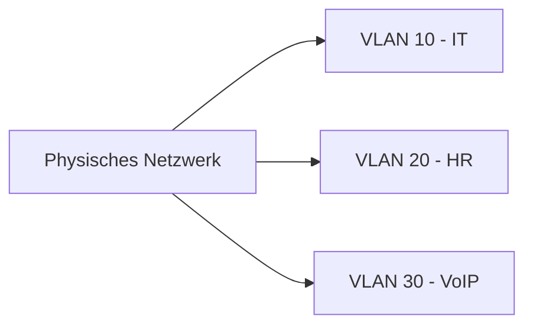

---
# Identity (stable; never change after publishing)
id: ap1-0272
slug: vlan-vorteile

# Display
title: "VLAN – Vorteile"

# Classification / navigation (machine-side)
module: "Entwickeln, Erstellen und Betreuen von IT_Lösungen"
topics: ["Netzwerk", "VLAN", "Strukturierung"]
tags: ["ap1", "vlan", "netzwerk", "segmentierung"]

# Flashcard payload
card:
  type: basic       # basic | multi | steps | definition | comparison
  question: "Was sind die Vorteile beim Einsatz eines Virtual Local Area Networks (VLAN)?"
  answer: "Logische Segmentierung des Netzwerks, Priorisierung des Datenverkehrs, bessere Lastverteilung, weniger Kollisionen durch Broadcast-Domänen, flexible Gruppierung und Trennung des Datenverkehrs."
  examples: ["Trennung von Abteilungen (z. B. HR und IT)", "Priorisierung von VoIP-Datenverkehr"]

# Lifecycle
status: published       # draft | published | deprecated
created: "2026-03-18"
updated: "2026-03-18"
---

## VLAN – Vorteile
Ein **VLAN (Virtual Local Area Network)** ermöglicht die **logische Segmentierung eines physischen Netzwerks**.

## Kernerklärung

Vorteile von VLANs:

- Aufteilung eines physischen Netzwerks in **logische Gruppen**
- **Priorisierung** von Datenverkehr möglich (z. B. VoIP)
- **Bessere Lastverteilung**
- **Reduzierung von Broadcast-Domänen** → weniger Kollisionen
- **Flexible Zuordnung** von Geräten zu Gruppen
- **Trennung von Datenverkehr** nach Anwendungen oder Abteilungen

## Praktisches Beispiel

- Unternehmen:
  - VLAN 10 → IT-Abteilung  
  - VLAN 20 → Personalabteilung  
  - VLAN 30 → VoIP-Telefonie  

→ Datenverkehr ist getrennt und sicherer

## Prüfungsrelevanz (AP1)

### Typische Prüfungsfragen
- Warum werden VLANs eingesetzt?  
- Was ist eine Broadcast-Domäne?  
- Welche Vorteile bieten VLANs?  

### Antworten auf die typischen Prüfungsfragen
- Zur Segmentierung und besseren Kontrolle des Netzwerks  
- Bereich, in dem Broadcasts verteilt werden  
- Sicherheit, Performance, Flexibilität  

## Merksatz
VLANs trennen Netzwerke logisch – für mehr Sicherheit, Übersicht und Leistung.