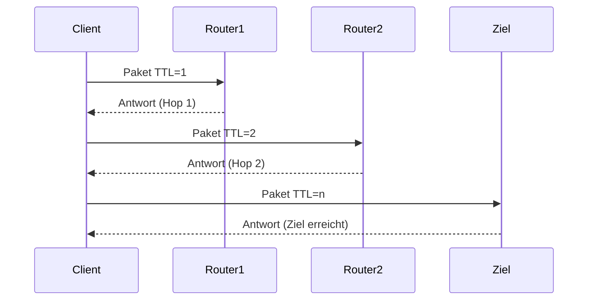

---
# Identity (stable; never change after publishing)
id: ap1-0273
slug: tracert-befehl-routenverfolgung

# Display
title: "tracert – Routenverfolgung"

# Classification / navigation (machine-side)
module: "Entwickeln, Erstellen und Betreuen von IT_Lösungen"
topics: ["Netzwerk", "Diagnose", "Tools"]
tags: ["ap1", "tracert", "netzwerk", "diagnose"]

# Flashcard payload
card:
  type: basic       # basic | multi | steps | definition | comparison
  question: "Mit welchem Befehlszeilenkommando lässt sich der Weg (Hops) zu einem Zielhost verfolgen und die Antwortzeiten messen?"
  answer: "tracert – zeigt den Weg (Hops) von einem Rechner zum Zielhost und misst die Antwortzeiten der einzelnen Stationen."
  examples: ["tracert www.google.de", "Analyse von Netzwerkproblemen"]

# Lifecycle
status: published       # draft | published | deprecated
created: "2026-03-18"
updated: "2026-03-18"
---

## tracert – Routenverfolgung
Der Befehl **tracert** (Windows) dient zur **Analyse von Netzwerkverbindungen**, indem er den Weg eines Pakets zum Ziel verfolgt.

## Kernerklärung

- tracert zeigt:
  - Alle **Zwischenstationen (Hops)** bis zum Ziel
  - **Antwortzeiten (ms)** pro Hop
- Funktionsweise:
  - Sendet Pakete mit steigender TTL (Time To Live)
  - Jeder Router reduziert TTL um 1
  - Bei TTL = 0 sendet Router eine Antwort zurück



## Praktisches Beispiel

```bash
tracert www.google.de
```

Ergebnis:
- Anzeige der Route über mehrere Router
- Zeitmessung pro Station
- Identifikation von Engpässen oder Ausfällen

## Prüfungsrelevanz (AP1)

### Typische Prüfungsfragen
- Wozu dient tracert?  
- Was sind „Hops“?  
- Was zeigt tracert an?  

### Antworten auf die typischen Prüfungsfragen
- Zur Analyse des Wegs von Datenpaketen  
- Zwischenstationen (Router) im Netzwerk  
- Route + Antwortzeiten  

## Merksatz
tracert zeigt den Weg der Daten durchs Netzwerk – Schritt für Schritt.