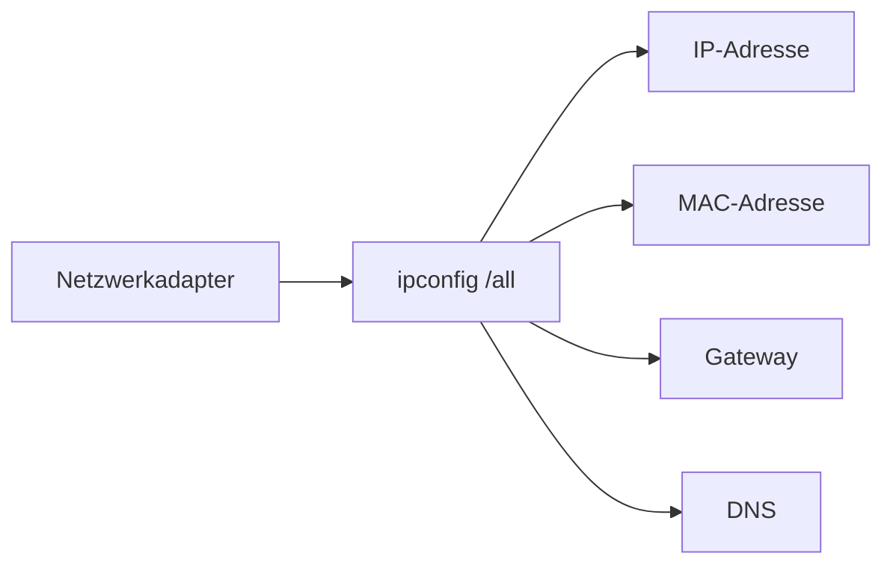

---
# Identity (stable; never change after publishing)
id: ap1-0276
slug: ipconfig-all-netzwerkinfo

# Display
title: "ipconfig /all – Netzwerkinformationen anzeigen"

# Classification / navigation (machine-side)
module: "Entwickeln, Erstellen und Betreuen von IT_Lösungen"
topics: ["Netzwerk", "Diagnose", "IP-Konfiguration"]
tags: ["ap1", "ipconfig", "netzwerk", "ip"]

# Flashcard payload
card:
  type: basic       # basic | multi | steps | definition | comparison
  question: "Mit welchem Befehlszeilenkommando lassen sich detaillierte Netzwerkinformationen wie IP-Adresse, MAC-Adresse, DNS-Server und Gateway anzeigen?"
  answer: "ipconfig /all – zeigt detaillierte Netzwerkinformationen wie IP-Adresse, MAC-Adresse, DNS-Server und Gateway."
  examples: ["ipconfig", "ipconfig /all"]

# Lifecycle
status: published       # draft | published | deprecated
created: "2026-03-18"
updated: "2026-03-18"
---

## ipconfig /all – Netzwerkinformationen anzeigen
Der Befehl **ipconfig /all** zeigt **detaillierte Informationen zu allen Netzwerkadaptern** eines Systems.

## Kernerklärung

Mit `ipconfig /all` erhält man:

- **IP-Adresse (IPv4 / IPv6)**
- **MAC-Adresse (physische Adresse)**
- **Subnetzmaske**
- **Standardgateway**
- **DNS-Server**
- **DHCP-Status (aktiv/inaktiv)**

→ Deutlich ausführlicher als `ipconfig`



## Praktisches Beispiel

```bash
ipconfig /all
```

Typische Ausgabe:
- Ethernet-Adapter:
  - IPv4: 192.168.x.x  
  - Gateway: 192.168.x.1  
  - DNS: 192.168.x.1  

## Prüfungsrelevanz (AP1)

### Typische Prüfungsfragen
- Was zeigt ipconfig /all?  
- Unterschied ipconfig vs. ipconfig /all?  
- Welche Informationen sind wichtig?  

### Antworten auf die typischen Prüfungsfragen
- Detaillierte Netzwerkinformationen  
- `/all` zeigt zusätzliche Details  
- IP, MAC, DNS, Gateway, DHCP  

## Merksatz
ipconfig /all zeigt alles über dein Netzwerk – von IP bis DNS.