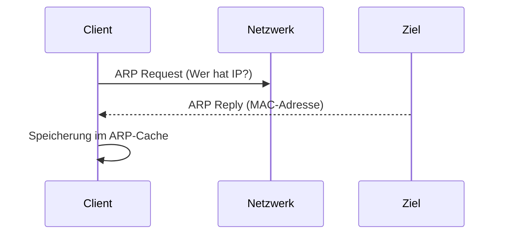

---
# Identity (stable; never change after publishing)
id: ap1-0277
slug: arp-befehl-aufgabe

# Display
title: "ARP – Aufgabe des Befehls"

# Classification / navigation (machine-side)
module: "Entwickeln, Erstellen und Betreuen von IT_Lösungen"
topics: ["Netzwerk", "ARP", "Protokolle"]
tags: ["ap1", "arp", "netzwerk", "mac"]

# Flashcard payload
card:
  type: basic       # basic | multi | steps | definition | comparison
  question: "Wofür wird das Befehlszeilenkommando ARP verwendet?"
  answer: "ARP dient zur Ermittlung und Anzeige der Zuordnung von IP-Adressen zu MAC-Adressen (ARP-Cache)."
  examples: ["arp -a", "Anzeige der ARP-Tabelle"]

# Lifecycle
status: published       # draft | published | deprecated
created: "2026-03-18"
updated: "2026-03-18"
---

## ARP – Aufgabe des Befehls
Der Befehl **ARP** wird genutzt, um die **Adressauflösung zwischen IP-Adresse und MAC-Adresse** darzustellen.

## Kernerklärung

- ARP (Address Resolution Protocol):
  - Wandelt **IP-Adresse → MAC-Adresse** um
- ARP-Befehl:
  - Zeigt den **ARP-Cache** an
  - Enthält gespeicherte Zuordnungen von:
    - IP-Adresse  
    - MAC-Adresse  

- Ablauf:
  1. Anfrage (Broadcast im Netzwerk)  
  2. Zielgerät antwortet mit MAC-Adresse  
  3. Speicherung im ARP-Cache  



## Praktisches Beispiel

```bash
arp -a
```

Ergebnis:
- Liste aller bekannten Geräte im lokalen Netzwerk  
- Anzeige von IP ↔ MAC Zuordnungen  

## Prüfungsrelevanz (AP1)

### Typische Prüfungsfragen
- Was macht der ARP-Befehl?  
- Was ist der ARP-Cache?  
- Wie funktioniert ARP?  

### Antworten auf die typischen Prüfungsfragen
- Zeigt IP-MAC-Zuordnungen  
- Zwischenspeicher für Adressauflösung  
- Anfrage → Antwort → Speicherung  

## Merksatz
ARP verbindet IP mit MAC – und speichert das Ergebnis im Cache.