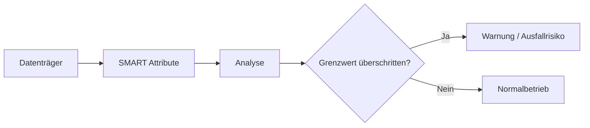

---
# Identity (stable; never change after publishing)
id: ap1-0279
slug: smart-festplattenueberwachung

# Display
title: "S.M.A.R.T. – Festplattenüberwachung"

# Classification / navigation (machine-side)
module: "Entwickeln, Erstellen und Betreuen von IT_Lösungen"
topics: ["Hardware", "Speicher", "Überwachung"]
tags: ["ap1", "smart", "festplatte", "diagnose"]

# Flashcard payload
card:
  type: basic       # basic | multi | steps | definition | comparison
  question: "Was bedeutet S.M.A.R.T. im Zusammenhang mit der Überwachung von Festplatten?"
  answer: "S.M.A.R.T. ist ein Selbstüberwachungs- und Diagnosesystem für HDDs/SSDs, das Zustandswerte analysiert und frühzeitig vor Ausfällen warnt."
  examples: ["Temperaturüberwachung", "Erkennung von Bad Blocks"]

# Lifecycle
status: published       # draft | published | deprecated
created: "2026-03-18"
updated: "2026-03-18"
---

## S.M.A.R.T. – Festplattenüberwachung
**S.M.A.R.T. (Self-Monitoring, Analysis and Reporting Technology)** ist ein System zur **Selbstüberwachung von Datenträgern** wie HDDs und SSDs.

## Kernerklärung

- Zweck:
  - **Früherkennung von Defekten**
  - Vermeidung von **Datenverlust**

- Funktionsweise:
  - Datenträger sammelt kontinuierlich **Zustandsdaten**
  - Speicherung als **SMART-Attribute**
  - Auswertung durch System oder Tools

- Wichtige Attribute:
  - Temperatur  
  - Betriebsstunden (Einschaltzeit)  
  - Anzahl fehlerhafter Sektoren (Bad Blocks)  
  - Lese-/Schreibfehler  

- Besonderheit:
  - Werte sind **nicht vollständig standardisiert**
  - Interpretation erfolgt je nach Hersteller unterschiedlich  



## Praktisches Beispiel

```bash
smartctl -a /dev/sda
```

- Zeigt:
  - Gesundheitsstatus  
  - SMART-Werte  
  - mögliche Warnungen  

## Prüfungsrelevanz (AP1)

### Typische Prüfungsfragen
- Was bedeutet S.M.A.R.T.?  
- Welche Aufgabe hat es?  
- Welche Werte werden überwacht?  

### Antworten auf die typischen Prüfungsfragen
- Selbstüberwachungssystem für Datenträger  
- Frühzeitige Fehlererkennung  
- Temperatur, Laufzeit, Fehlerwerte  

## Merksatz
S.M.A.R.T. überwacht den Zustand der Festplatte und warnt vor Ausfällen.