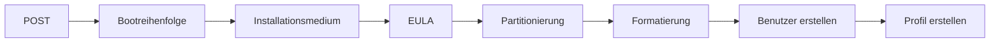

---
# Identity (stable; never change after publishing)
id: ap1-0280
slug: windows-installation-reihenfolge

# Display
title: "Windows-Installation – Reihenfolge der Schritte"

# Classification / navigation (machine-side)
module: "Entwickeln, Erstellen und Betreuen von IT_Lösungen"
topics: ["Betriebssysteme", "Installation", "Prozess"]
tags: ["ap1", "windows", "installation", "ablauf"]

# Flashcard payload
card:
  type: steps       # basic | multi | steps | definition | comparison
  question: "In welcher Reihenfolge werden die Schritte zur Installation eines Windows-Betriebssystems durchgeführt?"
  answer: "1. POST → 2. Bootreihenfolge festlegen → 3. Installationsmedium einlegen → 4. EULA akzeptieren → 5. Dateisystem anlegen → 6. Dateisystem formatieren → 7. Benutzer + Passwort anlegen → 8. Benutzerprofil erstellen"
  examples: ["Installation von Windows 10", "Neuinstallation eines PCs"]

# Lifecycle
status: published       # draft | published | deprecated
created: "2026-03-18"
updated: "2026-03-18"
---

## Windows-Installation – Reihenfolge der Schritte
Die Installation eines Windows-Betriebssystems erfolgt in einer **festen logischen Reihenfolge**, beginnend mit dem Systemstart bis zur ersten Benutzeranmeldung.

## Kernerklärung

### Reihenfolge der Installation

1. **POST (Power-On Self Test)**
2. **Bootreihenfolge festlegen**
3. **Installationsmedium einlegen**
4. **EULA lesen und akzeptieren**
5. **Dateisystem anlegen**
6. **Dateisystem formatieren**
7. **Benutzer + Passwort anlegen**
8. **Benutzerprofil für das erste Login erstellen**

## Praktisches Beispiel

- Neuinstallation von Windows:
  - BIOS/UEFI startet (POST)  
  - Boot von USB-Stick  
  - Installationsassistent führt durch:
    - Lizenz akzeptieren  
    - Partition auswählen  
    - Formatieren  
    - Benutzer anlegen  

## Prüfungsrelevanz (AP1)

### Typische Prüfungsfragen
- Welche Schritte gehören zur OS-Installation?  
- Was passiert zuerst (POST)?  
- Wann wird die EULA akzeptiert?  

### Antworten auf die typischen Prüfungsfragen
- Feste Reihenfolge von Boot bis Benutzer  
- POST ist der erste Schritt  
- Vor der eigentlichen Installation  

## Merksatz
Ohne POST kein Start – ohne Reihenfolge keine Installation.