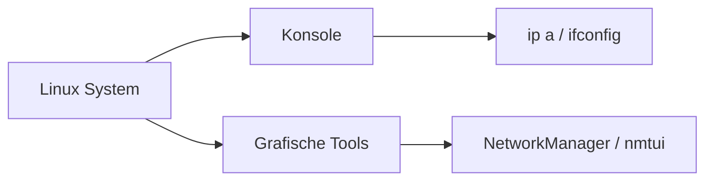

---
# Identity (stable; never change after publishing)
id: ap1-0281
slug: linux-ip-adresse-anzeigen

# Display
title: "Linux – IPv4-Adresse anzeigen"

# Classification / navigation (machine-side)
module: "Entwickeln, Erstellen und Betreuen von IT_Lösungen"
topics: ["Linux", "Netzwerk", "Diagnose"]
tags: ["ap1", "linux", "ip", "netzwerk"]

# Flashcard payload
card:
  type: basic       # basic | multi | steps | definition | comparison
  question: "Welche Kommandos oder Werkzeuge stehen unter Linux zum Anzeigen der IPv4-Adresse eines Netzwerkadapters zur Verfügung?"
  answer: "ifconfig, ip addr show, ip a sowie grafische Tools wie NetworkManager, nmtui, Wicd oder YaST."
  examples: ["ip a", "ifconfig"]

# Lifecycle
status: published       # draft | published | deprecated
created: "2026-03-18"
updated: "2026-03-18"
---

## Linux – IPv4-Adresse anzeigen
Unter Linux gibt es mehrere Möglichkeiten, um die **IPv4-Adresse eines Netzwerkadapters** anzuzeigen – sowohl über die **Konsole** als auch über **grafische Tools**.

## Kernerklärung

### Konsolenbefehle

- **ifconfig**
  - älteres Tool (teilweise veraltet)
- **ip addr show**
  - moderner Standardbefehl
- **ip a**
  - Kurzform von `ip addr show`

### Grafische Werkzeuge

- **NetworkManager**
- **nmtui** (textbasierte Oberfläche)
- **Wicd**
- **YaST** (SUSE)



## Praktisches Beispiel

```bash
ip a
```

→ Ausgabe zeigt:
- Netzwerkadapter (z. B. eth0, wlan0)  
- IPv4-Adresse (inet)  
- IPv6-Adresse  

## Prüfungsrelevanz (AP1)

### Typische Prüfungsfragen
- Welche Befehle zeigen die IP-Adresse unter Linux?  
- Unterschied ip vs. ifconfig?  
- Welche Tools gibt es grafisch?  

### Antworten auf die typischen Prüfungsfragen
- ip a, ip addr show, ifconfig  
- ip = moderner Standard  
- NetworkManager, nmtui, YaST  

## Merksatz
Unter Linux gilt: ip ist der Standard – ifconfig ist alt, aber bekannt.