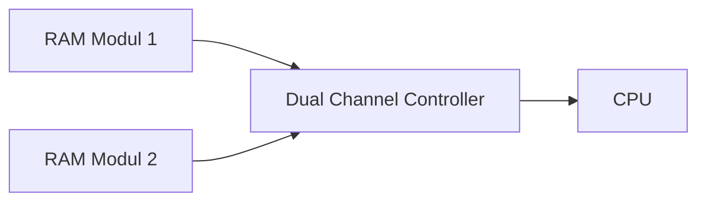

---
# Identity (stable; never change after publishing)
id: ap1-0283
slug: dual-channel-arbeitsspeicher-bedingungen

# Display
title: "Dual Channel – Voraussetzungen für Arbeitsspeicher"

# Classification / navigation (machine-side)
module: "Entwickeln, Erstellen und Betreuen von IT_Lösungen"
topics: ["Hardware", "Arbeitsspeicher", "Mainboard"]
tags: ["ap1", "ram", "dual-channel", "hardware"]

# Flashcard payload
card:
  type: basic       # basic | multi | steps | definition | comparison
  question: "Was muss beim Einsatz von Arbeitsspeichern im Dual Channel Mode beachtet werden?"
  answer: "Module müssen baugleich sein, gleiche Kapazität besitzen, kompatibel zum Mainboard/CPU sein und paarweise eingesetzt werden."
  examples: ["2×8 GB identische RAM-Module", "Dual Channel auf Mainboard aktiv"]

# Lifecycle
status: published       # draft | published | deprecated
created: "2026-03-18"
updated: "2026-03-18"
---

## Dual Channel – Voraussetzungen für Arbeitsspeicher
Der **Dual Channel Mode** erhöht die Speicherbandbreite, indem zwei RAM-Module parallel betrieben werden. Dafür müssen bestimmte Voraussetzungen erfüllt sein.

## Kernerklärung

### Voraussetzungen für Dual Channel

- **Baugleichheit**
  - gleiche Spezifikation (Takt, Typ, Hersteller idealerweise identisch)

- **Gleiche Speicherkapazität**
  - z. B. 8 GB + 8 GB

- **Kompatibilität**
  - Module müssen vom **Mainboard/CPU unterstützt** werden

- **Paarweise Installation**
  - Einbau in die richtigen Slots (z. B. Slot 1 + 3)

### Warum wichtig?

- Verdoppelte Speicherbandbreite
- Bessere Systemleistung (v. a. bei Grafik/Multitasking)

## Praktisches Beispiel

- Zwei identische 8 GB DDR4-Riegel  
- Einbau in passende Dual-Channel-Slots  
- BIOS aktiviert automatisch Dual Channel  

## Prüfungsrelevanz (AP1)

### Typische Prüfungsfragen
- Welche Voraussetzungen braucht Dual Channel?  
- Was passiert bei unterschiedlichen Modulen?  
- Wie wird Dual Channel aktiviert?  

### Antworten auf die typischen Prüfungsfragen
- Gleichheit + Paarbetrieb + Kompatibilität  
- Kein oder eingeschränkter Dual Channel  
- Durch korrektes Einbauen in passende Slots  

## Merksatz
Dual Channel funktioniert nur mit gleichen RAM-Paaren im richtigen Slot.