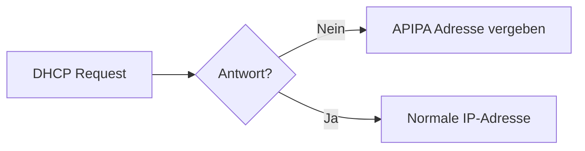

---
# Identity (stable; never change after publishing)
id: ap1-0284
slug: apipa-dhcp-erklaerung

# Display
title: "APIPA und DHCP – Verhalten bei fehlendem DHCP-Server"

# Classification / navigation (machine-side)
module: "Entwickeln, Erstellen und Betreuen von IT_Lösungen"
topics: ["Netzwerk", "IP-Adressierung", "DHCP"]
tags: ["ap1", "apipa", "dhcp", "ipv4"]

# Flashcard payload
card:
  type: basic       # basic | multi | steps | definition | comparison
  question: "Was bedeutet es, wenn ein Netzwerkadapter eine APIPA-Adresse (169.254.x.x) anzeigt?"
  answer: "Windows-System, keine statische IP gesetzt, DHCP-Request erfolglos, DHCP-Server nicht erreichbar, APIPA aktiviert, automatische IP aus 169.254.0.0/16."
  examples: ["169.254.10.5", "APIPA bei Netzwerkausfall"]

# Lifecycle
status: published       # draft | published | deprecated
created: "2026-03-18"
updated: "2026-03-18"
---

## APIPA und DHCP – Verhalten bei fehlendem DHCP-Server
Eine **APIPA-Adresse (169.254.x.x)** wird automatisch vergeben, wenn ein Rechner keine IP-Adresse über DHCP erhält.

## Kernerklärung

### Voraussetzungen für APIPA

- Betriebssystem: meist **Windows**
- **Keine statische IP-Adresse konfiguriert**
- **DHCP aktiviert**, aber:
  - DHCP-Server **nicht erreichbar**
  - DHCP-Request **nicht beantwortet**

### Eigenschaften von APIPA

| Merkmal              | Beschreibung                          |
|---------------------|--------------------------------------|
| Adressbereich       | 169.254.0.0 – 169.254.255.255        |
| Subnetzmaske        | 255.255.0.0 (/16)                    |
| Vergabe             | automatisch (zufällig)               |
| Internetzugriff     | nicht möglich                        |

### Funktionsweise

## Praktisches Beispiel

- PC bekommt keine Antwort vom DHCP-Server  
- Windows vergibt automatisch:  
  → 169.254.23.45  

→ Kommunikation nur im lokalen Netzwerk möglich (eingeschränkt)

## Prüfungsrelevanz (AP1)

### Typische Prüfungsfragen
- Was bedeutet eine 169.254.x.x-Adresse?  
- Wann wird APIPA verwendet?  
- Hat man damit Internetzugriff?  

### Antworten auf die typischen Prüfungsfragen
- Kein DHCP erreichbar  
- Automatische Ersatz-IP  
- Nein, kein Internetzugriff  

## Merksatz
169.254 bedeutet: DHCP fehlt – Windows hilft sich selbst.