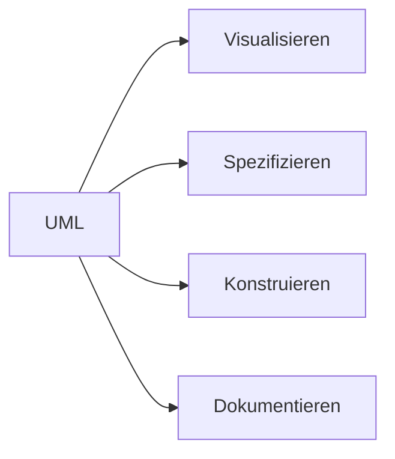

---
# Identity (stable; never change after publishing)
id: ap1-0285
slug: uml-bedeutung

# Display
title: "UML – Unified Modeling Language"

# Classification / navigation (machine-side)
module: "Entwickeln, Erstellen und Betreuen von IT_Lösungen"
topics: ["Modellierung", "UML", "Softwaredesign"]
tags: ["ap1", "uml", "modellierung", "grundlagen"]

# Flashcard payload
card:
  type: definition       # basic | multi | steps | definition | comparison
  question: "Wofür steht die Abkürzung UML?"
  answer: "UML (Unified Modeling Language) ist eine standardisierte grafische Modellierungssprache zur Visualisierung, Spezifikation, Konstruktion und Dokumentation von Softwaresystemen."
  examples: ["Klassendiagramm", "Sequenzdiagramm"]

# Lifecycle
status: published       # draft | published | deprecated
created: "2026-03-18"
updated: "2026-03-18"
---

## UML – Unified Modeling Language
**UML (Unified Modeling Language)** ist eine standardisierte Sprache zur Darstellung von Software-Systemen in Form von Diagrammen.

## Kernerklärung

### Zweck von UML

- **Visualisieren**
  - Systeme grafisch darstellen  
- **Spezifizieren**
  - Anforderungen und Strukturen beschreiben  
- **Konstruieren**
  - Grundlage für Entwicklung schaffen  
- **Dokumentieren**
  - Systeme verständlich festhalten  

### Eigenschaften

| Merkmal            | Beschreibung                                |
|--------------------|--------------------------------------------|
| Standardisiert     | Einheitliche Notation weltweit             |
| Grafisch           | Nutzung von Diagrammen                     |
| Einsatzbereich     | Software- und Systementwicklung            |
| Ziel               | Komplexität reduzieren                     |

## Praktisches Beispiel

- **Klassendiagramm**
  - zeigt Klassen, Attribute und Methoden  

- **Sequenzdiagramm**
  - zeigt Abläufe zwischen Objekten  

## Prüfungsrelevanz (AP1)

### Typische Prüfungsfragen
- Wofür steht UML?  
- Wozu wird UML verwendet?  
- Nenne typische UML-Diagramme  

### Antworten auf die typischen Prüfungsfragen
- Unified Modeling Language  
- Modellierung und Dokumentation von Software  
- Klassen-, Sequenz-, Use-Case-Diagramm  

## Merksatz
UML macht komplexe Software durch Diagramme verständlich.