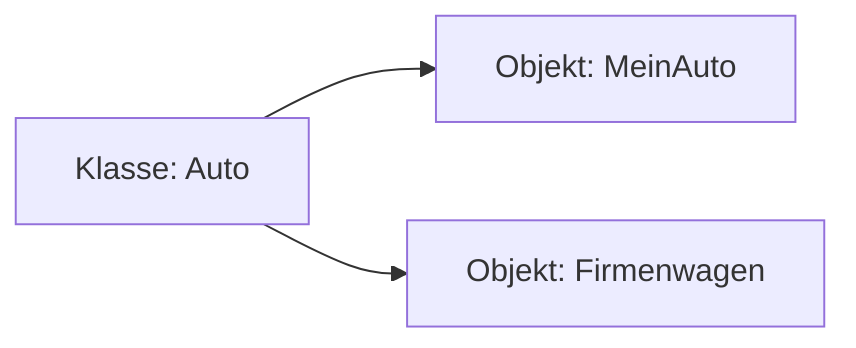

---
# Identity (stable; never change after publishing)
id: ap1-0287
slug: objekt-vs-klasse

# Display
title: "Objekt vs. Klasse – Unterschied"

# Classification / navigation (machine-side)
module: "Entwickeln, Erstellen und Betreuen von IT_Lösungen"
topics: ["OOP", "Grundlagen", "Klassen"]
tags: ["ap1", "oop", "klasse", "objekt"]

# Flashcard payload
card:
  type: comparison       # basic | multi | steps | definition | comparison
  question: "Worin unterscheiden sich ein Objekt und eine Klasse?"
  answer: "Eine Klasse ist ein Bauplan mit Attributen und Methoden; ein Objekt ist eine konkrete Instanz dieser Klasse mit konkreten Werten."
  examples: ["Klasse: Auto → Objekt: meinAuto (rot, 150 PS)"]

# Lifecycle
status: published       # draft | published | deprecated
created: "2026-03-18"
updated: "2026-03-18"
---

## Objekt vs. Klasse – Unterschied
In der objektorientierten Programmierung beschreibt eine **Klasse** den Bauplan, während ein **Objekt** eine konkrete Ausprägung davon ist.

## Kernerklärung

### Klasse

- Vorlage / Bauplan für Objekte  
- Definiert:
  - **Attribute** (Eigenschaften)
  - **Methoden** (Funktionen)
- Kann vererbt oder erweitert werden  

### Objekt

- Konkrete **Instanz einer Klasse**  
- Enthält:
  - konkrete Werte für Attribute  
- Nutzt die Methoden der Klasse  

### Vergleich

| Merkmal     | Klasse                          | Objekt                         |
|------------|----------------------------------|--------------------------------|
| Bedeutung   | Bauplan                         | Konkretes Exemplar            |
| Inhalt      | Attribute + Methoden            | Werte + Methoden              |
| Existenz    | abstrakt                        | real im Speicher              |
| Beispiel    | Auto                            | MeinAuto (rot, 150 PS)        |



## Praktisches Beispiel

```java
class Auto {
    String farbe;
    int ps;
}

Auto meinAuto = new Auto();
meinAuto.farbe = "rot";
meinAuto.ps = 150;
```

## Prüfungsrelevanz (AP1)

### Typische Prüfungsfragen
- Was ist eine Klasse?  
- Was ist ein Objekt?  
- Unterschied zwischen Klasse und Objekt?  

### Antworten auf die typischen Prüfungsfragen
- Klasse = Bauplan  
- Objekt = Instanz  
- Objekt hat konkrete Werte  

## Merksatz
Die Klasse ist der Bauplan – das Objekt ist das fertige Produkt.