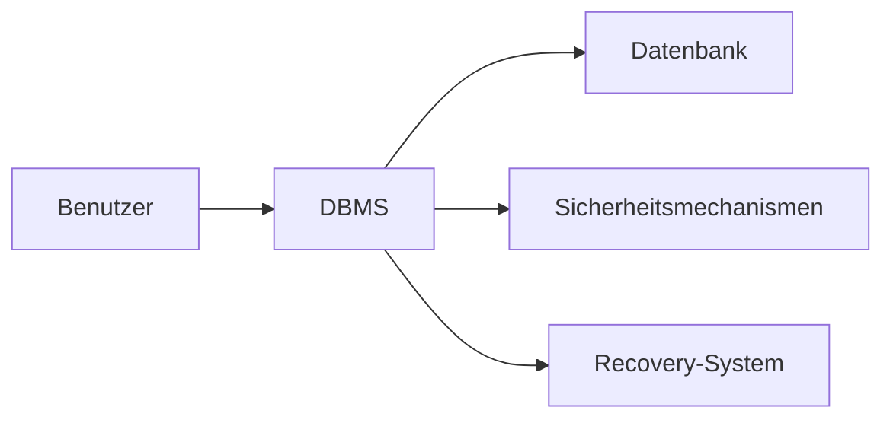

---
# Identity (stable; never change after publishing)
id: ap1-0288
slug: datenbanksystem-anforderungen

# Display
title: "Allgemeine Anforderungen an ein Datenbanksystem"

# Classification / navigation (machine-side)
module: "Entwickeln, Erstellen und Betreuen von IT_Lösungen"
topics: ["DBMS", "Grundlagen"]
tags: ["ap1", "datenbank", "dbms"]

# Flashcard payload
card:
  type: basic       # basic | multi | steps | definition | comparison
  question: "Welche Anforderungen muss ein Datenbanksystem erfüllen?"
  answer: "Datenunabhängigkeit, effizienter Speicherzugriff, paralleler Zugriff, Datenkonsistenz, gemeinsame Datenbasis, Datenintegrität, Datensicherheit, Wiederherstellungsverfahren, Abfragesprache, kontrollierte Redundanz."
  examples: []

# Lifecycle
status: published       # draft | published | deprecated
created: "2026-03-18"
updated: "2026-03-18"
---

## Allgemeine Anforderungen an ein Datenbanksystem
Ein Datenbanksystem (DBMS) muss verschiedene Anforderungen erfüllen, um Daten zuverlässig, effizient und sicher zu verwalten.

## Kernerklärung

### Zentrale Anforderungen

- **Datenunabhängigkeit**
  - Trennung von Daten und Anwendungsprogrammen  

- **Effizienter Speicherzugriff**
  - Schneller Zugriff auf große Datenmengen  

- **Paralleler Datenzugriff**
  - Mehrere Nutzer können gleichzeitig arbeiten  

- **Datenkonsistenz**
  - Daten bleiben korrekt und widerspruchsfrei  

- **Gemeinsame Datenbasis**
  - Zentrale Speicherung für alle Nutzer  

- **Datenintegrität**
  - Einhaltung definierter Regeln (z. B. Constraints)  

- **Datensicherheit**
  - Schutz vor unbefugtem Zugriff  

- **Wiederherstellungsverfahren**
  - Recovery nach Systemfehlern  

- **Abfragesprache**
  - z. B. SQL zur Datenabfrage  

- **Kontrollierte Redundanz**
  - Minimierung mehrfach gespeicherter Daten  

### Überblick als Tabelle

| Anforderung            | Zweck                                  |
|-----------------------|----------------------------------------|
| Datenunabhängigkeit   | Flexibilität bei Änderungen            |
| Konsistenz            | Korrekte Daten                         |
| Integrität            | Einhaltung von Regeln                  |
| Sicherheit            | Schutz vor Zugriff                     |
| Parallelität          | Mehrbenutzerbetrieb                    |
| Recovery              | Wiederherstellung bei Fehlern          |

## Praktisches Beispiel

Ein Unternehmen nutzt eine zentrale Datenbank:

- Mehrere Mitarbeiter greifen gleichzeitig zu  
- Daten werden über SQL abgefragt  
- Backups sichern die Wiederherstellung  
- Benutzerrechte schützen sensible Daten  

## Prüfungsrelevanz (AP1)

### Typische Prüfungsfragen
- Nenne Anforderungen an ein DBMS  
- Warum ist Datenkonsistenz wichtig?  
- Was bedeutet Datenunabhängigkeit?  

### Antworten auf die typischen Prüfungsfragen
- Liste der Anforderungen (siehe oben)  
- Konsistenz verhindert widersprüchliche Daten  
- Datenunabhängigkeit trennt Daten von Programmen  

## Merksatz
Ein DBMS sorgt für sichere, konsistente und effiziente Verwaltung von Daten.