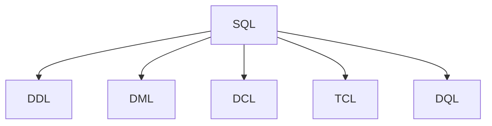

---
# Identity (stable; never change after publishing)
id: ap1-0290
slug: sql-befehlstypen

# Display
title: "SQL-Befehlstypen (DDL, DML, DCL, TCL, DQL)"

# Classification / navigation (machine-side)
module: "Entwickeln, Erstellen und Betreuen von IT_Lösungen"
topics: ["SQL", "DBMS"]
tags: ["ap1", "sql", "grundlagen"]

# Flashcard payload
card:
  type: basic       # basic | multi | steps | definition | comparison
  question: "Welche 5 SQL-Befehlstypen gibt es und welcher SQL-Befehl gehört jeweils dazu?"
  answer: "DDL: CREATE; DML: INSERT; DCL: GRANT; TCL: COMMIT; DQL: SELECT."
  examples: ["CREATE TABLE kunden (...);", "SELECT * FROM kunden;"]

# Lifecycle
status: published       # draft | published | deprecated
created: "2026-03-18"
updated: "2026-03-18"
---

## SQL-Befehlstypen (DDL, DML, DCL, TCL, DQL)
SQL-Befehle werden in verschiedene Kategorien eingeteilt, je nach Zweck im Datenbanksystem.

## Kernerklärung

### Die 5 SQL-Befehlstypen

| Typ  | Bedeutung | Beispiele |
|------|----------|----------|
| DDL  | Definition von Datenstrukturen | CREATE, ALTER, DROP, TRUNCATE |
| DML  | Bearbeiten von Daten | INSERT, UPDATE, DELETE |
| DCL  | Rechteverwaltung | GRANT, REVOKE |
| TCL  | Transaktionskontrolle | COMMIT, ROLLBACK, SAVEPOINT |
| DQL  | Datenabfrage | SELECT |



## Praktisches Beispiel

```sql
CREATE TABLE kunden (
  id INT PRIMARY KEY,
  name VARCHAR(50)
);

INSERT INTO kunden VALUES (1, 'Max');

SELECT * FROM kunden;

COMMIT;
```

## Prüfungsrelevanz (AP1)

### Typische Prüfungsfragen
- Nenne SQL-Befehlstypen  
- Beispiele für DML oder DDL  
- Unterschied zwischen DML und DDL  

### Antworten auf die typischen Prüfungsfragen
- DDL, DML, DCL, TCL, DQL  
- DDL = Struktur, DML = Daten  
- SELECT gehört zu DQL  

## Merksatz
DDL = Struktur, DML = Daten, DCL = Rechte, TCL = Transaktionen, DQL = Abfragen.