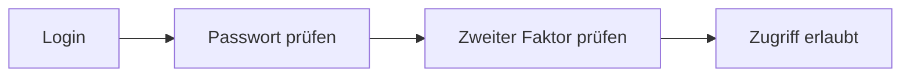

---
# Identity (stable; never change after publishing)
id: ap1-0200
slug: "multi-factor-authentication-mfa"

# Display
title: "Multi-Faktor-Authentifizierung (MFA)"

# Classification / navigation (machine-side)
module: "it-sicherheit"
topics: ["mfa", "authentifizierung", "zugriffssicherheit"]
tags: ["ap1", "sicherheit", "login", "schutz"]

# Flashcard payload
card:
  type: basic
  question: "Was bedeutet der Begriff MFA (Multi-Factor-Authentication) und wo kommt sie zum Einsatz?"
  answer: "MFA ist eine erweiterte Authentifizierung, bei der mehrere unabhängige Faktoren (z. B. Passwort und Code) überprüft werden, um den Zugriff zu gewähren; sie wird z. B. im Online-Banking oder bei Online-Zugängen eingesetzt."
  examples: []

# Lifecycle
status: published       # draft | published | deprecated
created: "2026-03-25"
updated: "2026-03-25"
---

## Multi-Faktor-Authentifizierung (MFA)
Multi-Faktor-Authentifizierung (MFA) erhöht die Sicherheit von Logins, indem mehrere Nachweise der Identität verlangt werden.

## Kernerklärung

### Grundprinzip
Statt nur eines Passworts werden **mindestens zwei unabhängige Faktoren** abgefragt:

| Faktor-Typ        | Beispiel |
|------------------|----------|
| Wissen           | Passwort, PIN |
| Besitz           | Smartphone, TAN per SMS/App |
| Biometrie        | Fingerabdruck, Gesichtserkennung |

Zugriff wird erst gewährt, wenn mehrere Faktoren korrekt sind.

### Vorteile
- Höhere Sicherheit gegen unbefugten Zugriff  
- Schutz vor Passwortdiebstahl  
- Standard bei sicherheitskritischen Anwendungen  

## Praktisches Beispiel
Login beim Online-Banking:

- Eingabe von Benutzername + Passwort  
- Zusätzlicher TAN-Code per App  

Nur bei beiden korrekten Angaben erfolgt der Zugriff

## Prüfungsrelevanz (AP1)

### Typische Prüfungsfragen
- Was ist MFA?
- Nenne Beispiele für Faktoren.
- Warum ist MFA sicherer als ein Passwort?

### Antworten auf die typischen Prüfungsfragen
- MFA ist eine Anmeldung mit mehreren unabhängigen Sicherheitsfaktoren.  
- Wissen (Passwort), Besitz (Smartphone), Biometrie (Fingerabdruck).  
- Weil ein einzelner kompromittierter Faktor nicht ausreicht.

## Merksatz
**MFA = Mehrere Nachweise → deutlich höhere Sicherheit beim Login.**