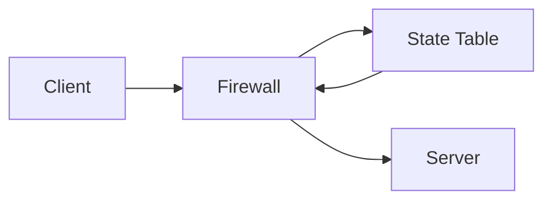

---
# Identity (stable; never change after publishing)
id: ap1-0210
slug: "stateful-packet-inspection-firewall"

# Display
title: "Stateful Packet Inspection (SPI) Firewall"

# Classification / navigation (machine-side)
module: "it-sicherheit"
topics: ["netzwerksicherheit", "firewall", "spi"]
tags: ["ap1", "grundlagen", "netzwerk", "sicherheit"]

# Flashcard payload
card:
  type: basic
  question: "Was ist eine SPI (Stateful Packet Inspection) Firewall?"
  answer: "Eine Firewall, die den Zustand von Verbindungen überwacht und Datenpakete anhand gespeicherter Sitzungsinformationen (z. B. TCP-Status) prüft und filtert."
  examples: []

# Lifecycle
status: published       # draft | published | deprecated
created: "2026-03-25"
updated: "2026-03-25"
---

## Stateful Packet Inspection (SPI) Firewall

Eine Stateful Packet Inspection (SPI) Firewall ist eine moderne Firewall-Technologie.

Im Gegensatz zu einfachen Firewalls betrachtet sie nicht nur einzelne Pakete, sondern auch den **Verbindungszustand**.

## Kernerklärung

### Funktionsweise
- Überwacht aktive Verbindungen (Sessions)  
- Speichert Zustände in **dynamischen Tabellen**  
- Prüft Pakete basierend auf:
  - Verbindungsstatus  
  - Protokollinformationen (z. B. TCP)  

### Wichtige Merkmale
- Erkennt gültige und ungültige Verbindungen  
- Nutzt TCP-Flags:
  - **SYN, ACK, FIN, RST**  
- Entscheidet über Weiterleitung von Paketen  

### Besonderheit
- Auch eigentlich **zustandslose Protokolle (UDP)** können bewertet werden  

## Praktisches Beispiel
Ein Nutzer ruft eine Website auf:

1. Verbindung wird aufgebaut (TCP SYN)  
2. Firewall speichert die Session  
3. Nur passende Antwortpakete werden durchgelassen  

Fremde oder manipulierte Pakete werden blockiert  

## Prüfungsrelevanz (AP1)

### Typische Prüfungsfragen
- Was ist eine SPI-Firewall?
- Was bedeutet „stateful“?
- Welche Vorteile hat sie gegenüber einfachen Firewalls?

### Antworten auf die typischen Prüfungsfragen
- Firewall mit Zustandsüberwachung.  
- Sie kennt den Verbindungsstatus.  
- Höhere Sicherheit durch Kontextprüfung.

## Merksatz
**Stateful heißt: Die Firewall merkt sich Verbindungen und prüft mit Kontext.**