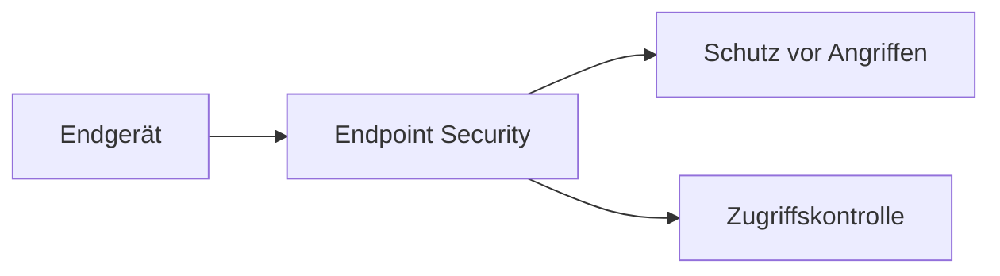

---
# Identity (stable; never change after publishing)
id: ap1-0211
slug: "endpoint-security"

# Display
title: "Endpoint Security"

# Classification / navigation (machine-side)
module: "it-sicherheit"
topics: ["netzwerksicherheit", "endpoint", "schutzmassnahmen"]
tags: ["ap1", "grundlagen", "sicherheit", "endgeraete"]

# Flashcard payload
card:
  type: basic
  question: "Was versteht man unter dem Begriff Endpoint-Security?"
  answer: "Alle Maßnahmen und Richtlinien zum Schutz von Endgeräten vor unbefugten Zugriffen und schädlichen Angriffen im Netzwerk."
  examples: []

# Lifecycle
status: published       # draft | published | deprecated
created: "2026-03-25"
updated: "2026-03-25"
---

## Endpoint Security

Endpoint Security schützt einzelne Endgeräte innerhalb eines Netzwerks.

Dazu gehören z. B. PCs, Laptops, Smartphones oder Server.

## Kernerklärung

### Definition
- Schutzmaßnahmen für **Endgeräte (Endpoints)**  
- Verhindert:
  - unbefugte Zugriffe  
  - Schadsoftware  
  - Angriffe von außen  

### Typische Maßnahmen
- Anwendungssperren (z. B. für E-Mail/Office)  
- Überwachung von Systemen  
- Kontrolle externer Datenträger (USB etc.)  
- Whitelisting von erlaubten Programmen  

## Praktisches Beispiel
Unternehmen setzt Richtlinien:

- USB-Sticks nur eingeschränkt erlaubt  
- Nur freigegebene Programme dürfen laufen  
- E-Mails werden gefiltert  

Endgeräte bleiben geschützt

## Prüfungsrelevanz (AP1)

### Typische Prüfungsfragen
- Was ist Endpoint Security?
- Welche Maßnahmen gehören dazu?
- Warum ist sie wichtig?

### Antworten auf die typischen Prüfungsfragen
- Schutz von Endgeräten im Netzwerk.  
- Überwachung, Zugriffskontrolle, Whitelisting.  
- Schutz vor Angriffen und Datenverlust.

## Merksatz
**Endpoint Security schützt jedes einzelne Gerät im Netzwerk.**