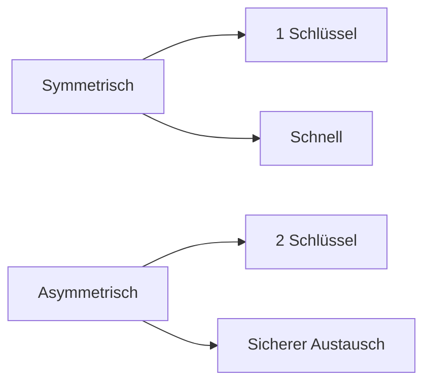

---
# Identity (stable; never change after publishing)
id: ap1-0214
slug: "symmetrisch-vs-asymmetrisch"

# Display
title: "Symmetrische vs. asymmetrische Verschlüsselung"

# Classification / navigation (machine-side)
module: "it-sicherheit"
topics: ["kryptografie", "verschluesselung", "vergleich"]
tags: ["ap1", "grundlagen", "sicherheit", "rsa", "aes"]

# Flashcard payload
card:
  type: basic
  question: "Vergleiche symmetrische und asymmetrische Verschlüsselung (Schlüsselanzahl, Geschwindigkeit, Schlüsselaustausch, Algorithmen, Anwendungsfälle)."
  answer: "Symmetrisch: ein Schlüssel, schnell, Schlüsselaustausch problematisch, z. B. AES/3DES, für große Datenmengen/VPN. Asymmetrisch: zwei Schlüssel, langsam, einfacher Austausch (öffentlicher Schlüssel), z. B. RSA/ECC, für Schlüsselaustausch und digitale Signaturen."
  examples: []

# Lifecycle
status: published       # draft | published | deprecated
created: "2026-03-25"
updated: "2026-03-25"
---

## Symmetrische vs. asymmetrische Verschlüsselung

Symmetrische und asymmetrische Verschlüsselung unterscheiden sich grundlegend in Aufbau und Einsatz.

Beide werden oft **kombiniert** verwendet (z. B. TLS).

## Kernerklärung

### Vergleich

| Kriterium              | Symmetrisch                     | Asymmetrisch                         |
|-----------------------|--------------------------------|--------------------------------------|
| Schlüsselanzahl       | 1 Schlüssel                    | 2 Schlüssel (öffentlich/privat)       |
| Geschwindigkeit       | schnell & effizient            | langsam & rechenintensiv             |
| Schlüsselaustausch    | problematisch                  | einfach (öffentlicher Schlüssel)     |
| Algorithmen           | AES, DES, 3DES                 | RSA, ECC, DSA                        |
| Anwendungsfälle       | große Datenmengen, VPN         | Signaturen, Schlüsselaustausch       |

### Typische Algorithmen
- **Symmetrisch:** AES, DES, 3DES  
- **Asymmetrisch:** RSA, ECC, DSA  

## Praktisches Beispiel
- **HTTPS (TLS):**
  - Asymmetrisch → Schlüsselaustausch  
  - Symmetrisch → Datenübertragung  

Kombination der Vorteile beider Verfahren

## Prüfungsrelevanz (AP1)

### Typische Prüfungsfragen
- Unterschied symmetrisch vs. asymmetrisch?  
- Wann wird welches Verfahren eingesetzt?  

### Antworten auf die typischen Prüfungsfragen
- Symmetrisch = schnell, aber Schlüsselproblem  
- Asymmetrisch = sicherer Austausch, aber langsam  
- Kombination in der Praxis üblich  

## Merksatz
**Symmetrisch = schnell, asymmetrisch = sicherer Schlüsselaustausch.**