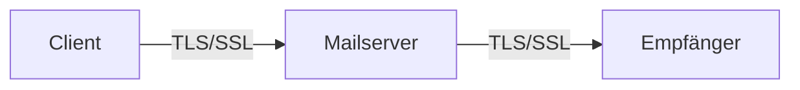

---
# Identity (stable; never change after publishing)
id: ap1-0222
slug: "mail-sicherheit"

# Display
title: "Sicherheitsmaßnahmen bei E-Mail-Systemen"

# Classification / navigation (machine-side)
module: "it-sicherheit"
topics: ["email", "verschluesselung", "netzwerk"]
tags: ["ap1", "kommunikation", "sicherheit"]

# Flashcard payload
card:
  type: basic
  question: "Welche Sicherheitsmaßnahmen sind beim Einsatz eines E-Mail-Systems zu beachten?"
  answer: "E-Mails verschlüsseln und signieren, TLS/SSL verwenden sowie POP3, IMAP und SMTP nur über sichere SSL/TLS-Ports betreiben."
  examples: []

# Lifecycle
status: published       # draft | published | deprecated
created: "2026-03-28"
updated: "2026-03-28"
---

## Sicherheitsmaßnahmen bei E-Mail-Systemen
E-Mail-Systeme sind ein häufiges Ziel für Angriffe (z. B. Abhören, Manipulation).

Daher müssen beim Einsatz geeignete Sicherheitsmaßnahmen umgesetzt werden.

## Kernerklärung

### Wichtige Maßnahmen

- **Verschlüsselung & Signatur:**
  - E-Mails sollten **verschlüsselt** übertragen werden  
  - Digitale Signaturen sichern die **Authentizität**  

- **TLS/SSL einsetzen:**
  - Nutzung von sicheren Zertifikaten  
  - Schutz der Daten während der Übertragung  

### Sichere Ports

| Protokoll | Port | Sicherheit |
|----------|------|-----------|
| POP3     | 995  | SSL/TLS   |
| IMAP     | 993  | SSL/TLS   |
| SMTP     | 465 / 587 | SSL/TLS |

Unsichere (unverschlüsselte) Verbindungen sollten vermieden werden.

## Praktisches Beispiel

Ein Unternehmen konfiguriert sein Mail-System:

- IMAP nur über Port 993  
- SMTP nur über Port 587  
- TLS-Zertifikate sind aktiv  

Ergebnis: Schutz vor Abhören und Manipulation von E-Mails.

## Prüfungsrelevanz (AP1)

### Typische Prüfungsfragen
- Welche Sicherheitsmaßnahmen gibt es für E-Mail-Systeme?  
- Welche Ports werden für sichere Mailprotokolle verwendet?  

### Antworten auf die typischen Prüfungsfragen
- Verschlüsselung, Signatur und TLS/SSL einsetzen  
- POP3: 995, IMAP: 993, SMTP: 465/587  

## Merksatz
**E-Mails nur verschlüsselt übertragen – sonst können sie mitgelesen werden.**