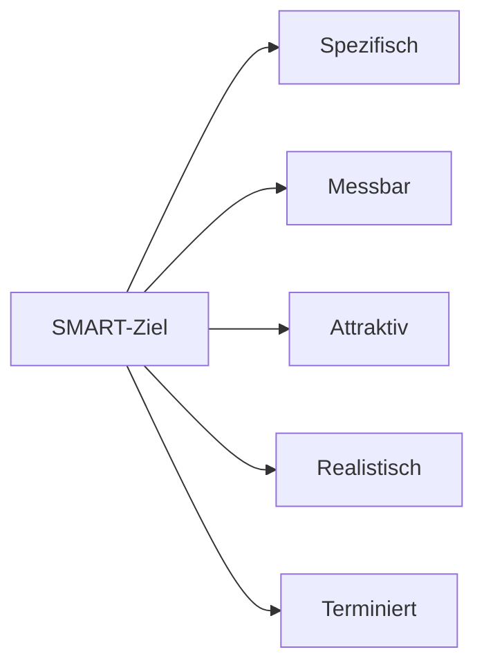

---
# Identity (stable; never change after publishing)
id: ap1-0226
slug: "smart-methode-projektmanagement"

# Display
title: "SMART-Methode im Projektmanagement"

# Classification / navigation (machine-side)
module: "projektmanagement"
topics: ["smart", "zieldefinition"]
tags: ["ap1", "planung", "methoden"]

# Flashcard payload
card:
  type: basic
  question: "Beschreibe die fünf Punkte der SMART-Methode im Projektmanagement."
  answer: "SMART = Spezifisch, Messbar, Attraktiv/Akzeptiert, Realistisch, Terminiert."
  examples: []

# Lifecycle
status: published       # draft | published | deprecated
created: "2026-03-28"
updated: "2026-03-28"
---

## SMART-Methode im Projektmanagement
Die SMART-Methode wird im Projektmanagement verwendet, um **klare und überprüfbare Ziele** zu definieren.

Sie stellt sicher, dass Ziele **verständlich, erreichbar und messbar** sind.

## Kernerklärung

Die SMART-Methode besteht aus fünf Kriterien:

| Kriterium | Bedeutung |
|----------|----------|
| **S – Spezifisch** | Ziele müssen klar und eindeutig formuliert sein |
| **M – Messbar** | Zielerreichung muss überprüfbar sein |
| **A – Attraktiv/Akzeptiert** | Ziele sollen motivierend und akzeptiert sein |
| **R – Realistisch** | Ziele müssen erreichbar sein |
| **T – Terminiert** | Ziele brauchen eine klare Zeitvorgabe |

### Zusammenhang

➡️ Nur wenn alle fünf Kriterien erfüllt sind, gilt ein Ziel als gut definiert.

## Praktisches Beispiel

❌ Schlechtes Ziel:  
„Die Website verbessern“

✅ SMART-Ziel:  
„Die Ladezeit der Website bis zum 01.06. um 30 % reduzieren“

Ergebnis: klar, messbar und terminiert

## Prüfungsrelevanz (AP1)

### Typische Prüfungsfragen
- Wofür steht SMART?  
- Warum ist die SMART-Methode wichtig?  

### Antworten auf die typischen Prüfungsfragen
- Spezifisch, Messbar, Attraktiv, Realistisch, Terminiert  
- Sie hilft, klare und überprüfbare Ziele zu definieren  

## Merksatz
**SMART = Klare Ziele statt vager Wünsche.**