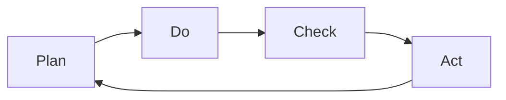

---
# Identity (stable; never change after publishing)
id: ap1-0236
slug: "vorteile-iso-27001-zertifizierung"

# Display
title: "Vorteile einer ISO 27001 Zertifizierung"

# Classification / navigation (machine-side)
module: "it-sicherheit"
topics: ["iso27001", "isms", "vorteile"]
tags: ["ap1", "it-sicherheit", "normen"]

# Flashcard payload
card:
  type: basic
  question: "Was sind die Vorteile einer Zertifizierung nach ISO 27001?"
  answer: "Verbesserter Schutz von Informationen und Prozessen, Vertrauensgewinn bei Kunden und Partnern, kontinuierliche Verbesserung (PDCA), geringere Kosten durch weniger Sicherheitsvorfälle sowie höheres Sicherheitsbewusstsein."
  examples: []

# Lifecycle
status: published       # draft | published | deprecated
created: "2026-03-28"
updated: "2026-03-28"
---

## Vorteile einer ISO 27001 Zertifizierung

Eine ISO 27001 Zertifizierung bringt Unternehmen strukturierte Informationssicherheit und messbare Vorteile im Betrieb und Wettbewerb.

## Kernerklärung

### Zentrale Vorteile

- **Schutz von Informationen und Geschäftsprozessen**
- **Vertrauensgewinn** bei Kunden, Partnern und Investoren  
- **Kontinuierliche Verbesserung** (PDCA-Zyklus)  
- **Kostenreduktion** durch weniger Sicherheitsvorfälle  
- **Risikominimierung & Optimierung** im Umgang mit Daten  
- **Steigerung des Sicherheitsbewusstseins** der Mitarbeitenden  

### PDCA-Zyklus (Grundprinzip)

## Praktisches Beispiel

Ein Unternehmen mit ISO 27001:

- erkennt Sicherheitslücken frühzeitig  
- reduziert Ausfälle durch präventive Maßnahmen  
- gewinnt Vertrauen bei Kunden durch Zertifizierung  

## Prüfungsrelevanz (AP1)

### Typische Prüfungsfragen
- Nenne Vorteile einer ISO 27001 Zertifizierung  
- Warum ist der PDCA-Zyklus wichtig?  

### Antworten auf die typischen Prüfungsfragen
- Sicherheit, Vertrauen, Kostenersparnis, Verbesserung  
- Er sorgt für kontinuierliche Optimierung der Sicherheit  

## Merksatz
**ISO 27001 schafft Sicherheit, Vertrauen und kontinuierliche Verbesserung.**