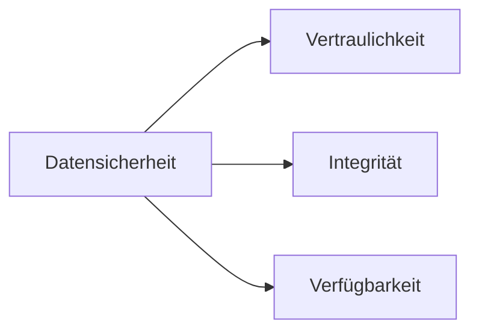

---
# Identity (stable; never change after publishing)
id: ap1-0301
slug: "datensicherheit-schutzziele"

# Display
title: "Datensicherheit und Schutzziele"

# Classification / navigation (machine-side)
module: "IT-Sicherheit und Datenschutz, Ergonomie"
topics: ["datensicherheit", "schutzziele", "cia-triad"]
tags: ["ap1", "sicherheit", "grundlagen", "risiken"]

# Flashcard payload
card:
  type: basic
  question: "Was versteht man unter Datensicherheit und welche Schutzziele gehören dazu?"
  answer: "Datensicherheit umfasst Maßnahmen zum Schutz von Daten vor Gefahren und zielt auf die Schutzziele Vertraulichkeit, Integrität und Verfügbarkeit ab."
  examples: []

# Lifecycle
status: published       # draft | published | deprecated
created: "2026-03-25"
updated: "2026-03-25"
---

## Datensicherheit und Schutzziele
Datensicherheit (auch Informationssicherheit) umfasst alle Maßnahmen, die Daten vor Verlust, Manipulation und unbefugtem Zugriff schützen.

## Kernerklärung

### Die 3 klassischen Schutzziele (CIA-Triade)

| Schutzziel        | Bedeutung |
|------------------|----------|
| Vertraulichkeit  | Nur berechtigte Personen dürfen auf Daten zugreifen |
| Integrität       | Daten sind korrekt und unverändert |
| Verfügbarkeit    | Daten und Systeme sind jederzeit erreichbar |

### Erweiterte Schutzziele
- **Authentizität** → Echtheit und Vertrauenswürdigkeit von Daten  
- **Nachvollziehbarkeit** → Aktionen sind überprüfbar  

### Ziel der Datensicherheit
- Schutz vor Bedrohungen (z. B. Hacker, Datenverlust)  
- Vermeidung wirtschaftlicher Schäden  
- Minimierung von Risiken im IT-Bereich  

## Praktisches Beispiel
Ein Unternehmen schützt Kundendaten:

- Zugriff nur für autorisierte Mitarbeiter (Vertraulichkeit)  
- Änderungen werden protokolliert (Integrität)  
- Server werden redundant betrieben (Verfügbarkeit)  

Ergebnis: Daten sind sicher, korrekt und jederzeit nutzbar

## Prüfungsrelevanz (AP1)

### Typische Prüfungsfragen
- Was bedeutet Datensicherheit?
- Nenne die drei Schutzziele.
- Was versteht man unter Integrität?

### Antworten auf die typischen Prüfungsfragen
- Schutz von Daten vor Verlust, Manipulation und unbefugtem Zugriff.  
- Vertraulichkeit, Integrität, Verfügbarkeit.  
- Integrität bedeutet, dass Daten korrekt und unverändert sind.

## Merksatz
**CIA-Triade: Vertraulich, korrekt und verfügbar – so müssen Daten sein.**