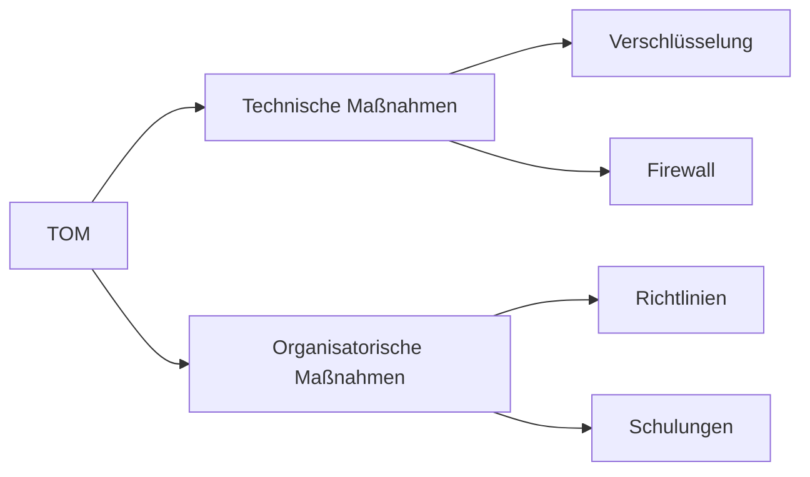

---
# Identity (stable; never change after publishing)
id: ap1-0303
slug: "technisch-organisatorische-massnahmen-tom"

# Display
title: "Technisch-organisatorische Maßnahmen (TOM)"

# Classification / navigation (machine-side)
module: "IT-Sicherheit und Datenschutz, Ergonomie"
topics: ["datenschutz", "ds-gvo", "tom"]
tags: ["ap1", "recht", "sicherheit", "organisation"]

# Flashcard payload
card:
  type: basic
  question: "Was versteht man im Datenschutz unter technisch-organisatorischen Maßnahmen (TOM)?"
  answer: "Technisch-organisatorische Maßnahmen (TOM) sind Maßnahmen nach DSGVO, die sicherstellen, dass personenbezogene Daten nur zweckgebunden, minimal, sicher und nur für Berechtigte verarbeitet werden."
  examples: []

# Lifecycle
status: published       # draft | published | deprecated
created: "2026-03-25"
updated: "2026-03-25"
---

## Technisch-organisatorische Maßnahmen (TOM)
Technisch-organisatorische Maßnahmen (TOM) sind ein zentraler Bestandteil des Datenschutzes nach DSGVO.

Sie dienen dazu, personenbezogene Daten:
- zu schützen  
- korrekt zu verarbeiten  
- vor unbefugtem Zugriff zu sichern  

## Kernerklärung

### Grundlage (§ 25 Abs. 2 DSGVO)
Verantwortliche müssen geeignete Maßnahmen treffen, damit:

- nur **notwendige Daten** verarbeitet werden  
- Daten nur für einen **bestimmten Zweck** genutzt werden  
- Daten nur **befugten Personen** zugänglich sind  

### Ziele der TOM
- Datenminimierung  
- Zweckbindung  
- Zugriffsbeschränkung  
- Schutz vor unbefugtem Zugriff  

### Beispiele für TOM

| Technische Maßnahmen        | Organisatorische Maßnahmen       |
|-----------------------------|----------------------------------|
| Verschlüsselung             | Berechtigungskonzepte            |
| Firewalls                   | Schulungen der Mitarbeiter       |
| Zugriffskontrollen          | Richtlinien & Prozesse           |
| Backup-Systeme              | Datenschutzrichtlinien           |

## Praktisches Beispiel
Ein Unternehmen speichert Kundendaten:

- Zugriff nur über Login-System (technisch)  
- Mitarbeiter dürfen nur notwendige Daten sehen (organisatorisch)  
- Daten werden verschlüsselt gespeichert  

Ergebnis: DSGVO-konforme Verarbeitung

## Prüfungsrelevanz (AP1)

### Typische Prüfungsfragen
- Was sind technisch-organisatorische Maßnahmen?
- Warum sind TOM wichtig?
- Nenne Beispiele für TOM.

### Antworten auf die typischen Prüfungsfragen
- Maßnahmen zum Schutz personenbezogener Daten gemäß DSGVO.  
- Sie sichern Datenschutz und verhindern Missbrauch.  
- Verschlüsselung, Zugriffskontrolle, Richtlinien.

## Merksatz
**TOM sorgen dafür, dass nur nötige Daten sicher und korrekt verarbeitet werden.**