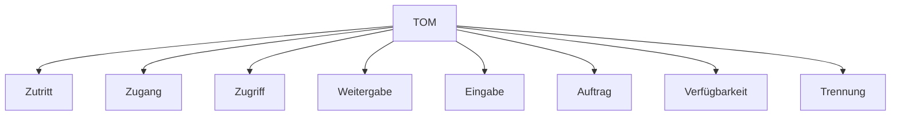

---
# Identity (stable; never change after publishing)
id: ap1-0304
slug: "tom-kontrollen-dsgvo"

# Display
title: "Konkrete Maßnahmen der TOM (DSGVO)"

# Classification / navigation (machine-side)
module: "IT-Sicherheit und Datenschutz, Ergonomie"
topics: ["datenschutz", "tom", "zugriffskontrolle"]
tags: ["ap1", "ds-gvo", "sicherheit", "maßnahmen"]

# Flashcard payload
card:
  type: basic
  question: "Wie können technisch-organisatorische Maßnahmen (TOM) DSGVO-konform in der Praxis umgesetzt werden?"
  answer: "Durch Zutritts-, Zugangs-, Zugriffs-, Weitergabe-, Eingabe-, Auftrags-, Verfügbarkeits- und Trennungskontrollen."
  examples: []

# Lifecycle
status: published       # draft | published | deprecated
created: "2026-03-25"
updated: "2026-03-25"
---

## Konkrete Maßnahmen der TOM (DSGVO)

Die DSGVO fordert konkrete Maßnahmen (TOM), um personenbezogene Daten wirksam zu schützen. Diese werden in verschiedene Kontrollarten unterteilt.

## Kernerklärung

### Wichtige Kontrollarten der TOM

| Kontrolle              | Bedeutung |
|-----------------------|----------|
| Zutrittskontrolle     | Unbefugte dürfen Gebäude/Serverräume nicht betreten |
| Zugangskontrolle      | Unbefugte dürfen keine IT-Systeme nutzen |
| Zugriffskontrolle     | Nur Berechtigte dürfen auf bestimmte Daten zugreifen |
| Weitergabekontrolle   | Daten dürfen nicht unbefugt übertragen oder kopiert werden |
| Eingabekontrolle      | Änderungen an Daten sind nachvollziehbar |
| Auftragskontrolle     | Verarbeitung erfolgt nur nach Anweisung |
| Verfügbarkeitskontrolle | Schutz vor Verlust oder Zerstörung (z. B. Backup) |
| Trennungskontrolle    | Daten werden zweckgebunden getrennt verarbeitet |

### Ziel der Maßnahmen
- Schutz vor unbefugtem Zugriff  
- Nachvollziehbarkeit von Änderungen  
- Sicherstellung der Datenverarbeitung nach DSGVO  

## Praktisches Beispiel
Ein Unternehmen setzt folgende Maßnahmen um:

- Serverraum nur mit Chipkarte zugänglich (Zutrittskontrolle)  
- Login mit Passwort und MFA (Zugangskontrolle)  
- Rollenbasierte Rechte im System (Zugriffskontrolle)  
- Protokollierung aller Änderungen (Eingabekontrolle)  

Ergebnis: DSGVO-konforme Verarbeitung personenbezogener Daten

## Prüfungsrelevanz (AP1)

### Typische Prüfungsfragen
- Nenne Beispiele für technisch-organisatorische Maßnahmen.
- Was ist eine Zugriffskontrolle?
- Warum ist die Trennungskontrolle wichtig?

### Antworten auf die typischen Prüfungsfragen
- Zutritts-, Zugangs-, Zugriffskontrolle usw.  
- Sie stellt sicher, dass nur Berechtigte auf Daten zugreifen.  
- Sie verhindert die Vermischung von Daten unterschiedlicher Zwecke.

## Merksatz
**TOM = Kontrolle auf allen Ebenen: vom Gebäude bis zur Datenverarbeitung.**