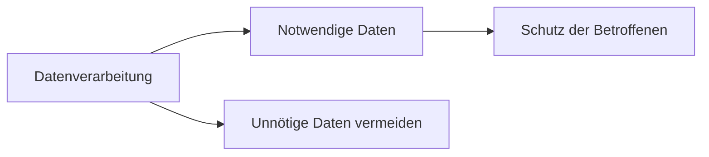

---
# Identity (stable; never change after publishing)
id: ap1-0306
slug: "datenminimierung-ziele"

# Display
title: "Ziele der Datenminimierung"

# Classification / navigation (machine-side)
module: "IT-Sicherheit und Datenschutz, Ergonomie"
topics: ["datenschutz", "datenminimierung", "ds-gvo"]
tags: ["ap1", "grundlagen", "datenschutz", "prinzipien"]

# Flashcard payload
card:
  type: basic
  question: "Was sind die Ziele der Datenminimierung?"
  answer: "Nur so viele personenbezogene Daten wie nötig erheben und speichern, um Betroffene vor übermäßiger Datenspeicherung und Missbrauch zu schützen."
  examples: []

# Lifecycle
status: published       # draft | published | deprecated
created: "2026-03-25"
updated: "2026-03-25"
---

## Ziele der Datenminimierung

Datenminimierung ist ein zentraler Grundsatz des Datenschutzes.

Ziel ist es, die Verarbeitung personenbezogener Daten auf das **notwendige Minimum** zu beschränken.

## Kernerklärung

### Grundprinzip
- **„So viele Daten wie nötig, so wenige wie möglich“**

### Ziele der Datenminimierung
- Vermeidung unnötiger Datenspeicherung  
- Schutz der Privatsphäre von Betroffenen  
- Reduzierung von Risiken (z. B. Datenmissbrauch)  
- Einhaltung der DSGVO  

### Zusammenhang mit Datenschutz
- Daten dürfen nur für einen **bestimmten Zweck** erhoben werden  
- Es dürfen nur die Daten verarbeitet werden, die **wirklich erforderlich** sind  

## Praktisches Beispiel
Ein Online-Shop:

- Erfragt nur Name und Adresse (für Lieferung notwendig)  
- Verzichtet auf unnötige Angaben wie Geburtsdatum  

Ergebnis: Weniger Daten = weniger Risiko  

## Prüfungsrelevanz (AP1)

### Typische Prüfungsfragen
- Was bedeutet Datenminimierung?
- Warum ist Datenminimierung wichtig?
- Nenne ein Beispiel.

### Antworten auf die typischen Prüfungsfragen
- Nur notwendige Daten werden erhoben.  
- Schutz der Privatsphäre und weniger Risiko.  
- Online-Shop fragt nur notwendige Daten ab.

## Merksatz
**So viel wie nötig – so wenig wie möglich.**