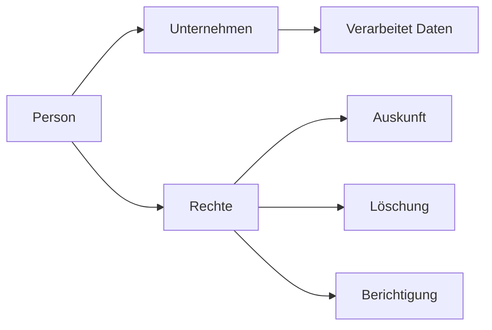

---
# Identity (stable; never change after publishing)
id: ap1-0307
slug: "rechte-personenbezogene-daten-dsgvo"

# Display
title: "Rechte betroffener Personen (DSGVO)"

# Classification / navigation (machine-side)
module: "IT-Sicherheit und Datenschutz, Ergonomie"
topics: ["datenschutz", "dsgvo", "betroffenenrechte"]
tags: ["ap1", "grundlagen", "rechte", "eu"]

# Flashcard payload
card:
  type: basic
  question: "Über welche Rechte verfügt eine Person bezüglich ihrer personenbezogenen Daten?"
  answer: "Auskunftsrecht, Recht auf Berichtigung, Löschung („Recht auf Vergessenwerden“), Einschränkung der Verarbeitung, Datenübertragbarkeit, Widerspruchsrecht sowie Rechte bei automatisierten Entscheidungen."
  examples: []

# Lifecycle
status: published       # draft | published | deprecated 
created: "2026-03-25"
updated: "2026-03-25"
---

## Rechte betroffener Personen (DSGVO)
Die DSGVO definiert klare Rechte für Personen (Betroffene), um die Kontrolle über ihre personenbezogenen Daten zu behalten.

Diese Rechte sind ein zentraler Bestandteil des Datenschutzes in der EU.

## Kernerklärung

### Wichtige Betroffenenrechte
- **Auskunftsrecht** → Welche Daten werden verarbeitet?  
- **Recht auf Berichtigung** → Falsche Daten korrigieren  
- **Recht auf Löschung** → Daten löschen lassen („Recht auf Vergessenwerden“)  
- **Recht auf Einschränkung der Verarbeitung**  
- **Recht auf Datenübertragbarkeit**  
- **Widerspruchsrecht**  
- **Rechte bei automatisierten Entscheidungen**  

### Ergänzende Pflichten
- Informationspflicht bei Datenerhebung  
- Informationspflicht, wenn Daten nicht direkt erhoben wurden  

## Praktisches Beispiel
Ein Kunde fordert von einem Online-Shop:

- Auskunft über gespeicherte Daten  
- Löschung seines Kundenkontos  

Das Unternehmen muss diesen Anfragen nachkommen.

## Prüfungsrelevanz (AP1)

### Typische Prüfungsfragen
- Nenne die Rechte betroffener Personen nach DSGVO.
- Was bedeutet das Recht auf Vergessenwerden?
- Welche Informationspflichten bestehen?

### Antworten auf die typischen Prüfungsfragen
- Auskunft, Berichtigung, Löschung, Einschränkung, Übertragbarkeit, Widerspruch.  
- Daten müssen auf Wunsch gelöscht werden.  
- Betroffene müssen über Datenerhebung informiert werden.

## Merksatz
**Betroffene haben das Recht zu wissen, zu ändern, zu löschen und zu widersprechen.**