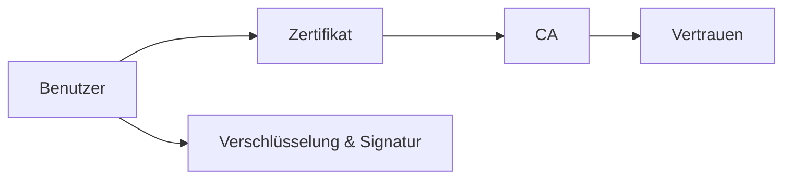

---
# Identity (stable; never change after publishing)
id: ap1-0308
slug: "public-key-infrastruktur-pki"

# Display
title: "Public Key Infrastruktur (PKI)"

# Classification / navigation (machine-side)
module: "IT-Sicherheit und Datenschutz, Ergonomie"
topics: ["kryptografie", "pki", "zertifikate"]
tags: ["ap1", "grundlagen", "verschluesselung", "authentifizierung"]

# Flashcard payload
card:
  type: basic
  question: "Erkläre den Begriff PKI (Public Key Infrastructure)."
  answer: "Ein System zur Erstellung, Verwaltung und Prüfung digitaler Zertifikate, das mittels asymmetrischer Kryptografie die sichere Verschlüsselung und Signatur von Daten ermöglicht."
  examples: []

# Lifecycle
status: published       # draft | published | deprecated
created: "2026-03-25"
updated: "2026-03-25"
---

## Public Key Infrastruktur (PKI)
Die Public Key Infrastruktur (PKI) ist ein zentraler Bestandteil moderner IT-Sicherheit.

Sie ermöglicht die sichere Kommunikation durch Verschlüsselung und digitale Signaturen.

## Kernerklärung

### Was ist eine PKI?
- Kryptografisches System innerhalb einer Infrastruktur  
- Nutzt **asymmetrische Verschlüsselung** (Public/Private Key)  
- Dient zur:
  - Verschlüsselung von Daten  
  - digitalen Signatur  
  - Authentifizierung von Teilnehmern  

### Wichtige Bestandteile einer PKI
- **Zertifizierungsstellen (CA)**  
- **Registrierungsstellen (RA)**  
- **Digitale Zertifikate**  
- **Zertifikatssperrlisten (CRL)**  
- **Verzeichnisdienste**  
- **Validierungsdienste**

## Praktisches Beispiel
HTTPS-Verbindung:

- Browser prüft das Zertifikat einer Website  
- Zertifikat wurde von einer vertrauenswürdigen CA ausgestellt  
- Verbindung wird verschlüsselt aufgebaut  

Sichere Datenübertragung im Internet

## Prüfungsrelevanz (AP1)

### Typische Prüfungsfragen
- Was ist eine PKI?
- Welche Bestandteile hat eine PKI?
- Wozu dient sie?

### Antworten auf die typischen Prüfungsfragen
- System für Zertifikate und Verschlüsselung.  
- CA, RA, Zertifikate, CRL etc.  
- Sicherer Datenaustausch und Authentifizierung.

## Merksatz
**PKI sorgt für Vertrauen durch Zertifikate und sichere Verschlüsselung.**