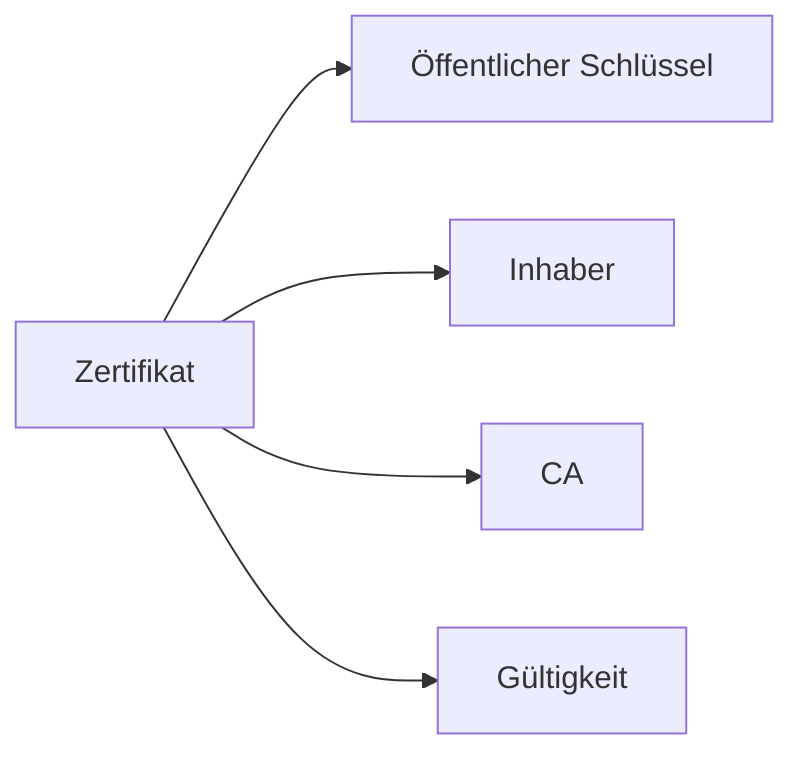

---
# Identity (stable; never change after publishing)
id: ap1-0309
slug: "digitales-zertifikat"

# Display
title: "Digitales Zertifikat"

# Classification / navigation (machine-side)
module: "IT-Sicherheit und Datenschutz, Ergonomie"
topics: ["kryptografie", "zertifikate", "pki"]
tags: ["ap1", "grundlagen", "verschluesselung", "authentifizierung"]

# Flashcard payload
card:
  type: basic
  question: "Was versteht man unter einem digitalen Zertifikat?"
  answer: "Ein digitaler Datensatz, der mithilfe kryptografischer Schlüssel die Authentizität von Personen, Webseiten oder Organisationen bestätigt und deren öffentliche Schlüssel enthält."
  examples: []

# Lifecycle
status: published       # draft | published | deprecated
created: "2026-03-25"
updated: "2026-03-25"
---

## Digitales Zertifikat

Ein digitales Zertifikat ist ein zentrales Element der IT-Sicherheit und Bestandteil der PKI.

Es dient dazu, Identitäten im Internet eindeutig und vertrauenswürdig zu bestätigen.

## Kernerklärung

### Definition
- Digitaler Datensatz zur **Authentifizierung**
- Enthält einen **öffentlichen Schlüssel**
- Wird durch eine **Zertifizierungsstelle (CA)** ausgestellt  

### Eigenschaften
- Basiert meist auf dem **X.509-Standard**  
- Nutzt **asymmetrische Kryptografie**  
- Gewährleistet:
  - **Authentizität**
  - **Vertraulichkeit**
  - **Integrität**

### Aufbau (vereinfacht)

| Bestandteil            | Beschreibung                          |
|----------------------|--------------------------------------|
| Öffentlicher Schlüssel | Für Verschlüsselung/Verifikation      |
| Inhaber              | Person/Organisation/Webseite          |
| Aussteller (CA)      | Vertrauenswürdige Stelle              |
| Gültigkeit           | Zeitraum der Nutzung                  |

## Praktisches Beispiel
HTTPS-Webseite:

- Website besitzt ein digitales Zertifikat  
- Browser prüft dieses Zertifikat  
- Verbindung wird als sicher angezeigt (Schloss-Symbol)  

Nutzer kann sicher kommunizieren

## Prüfungsrelevanz (AP1)

### Typische Prüfungsfragen
- Was ist ein digitales Zertifikat?
- Welche Informationen enthält es?
- Wozu wird es verwendet?

### Antworten auf die typischen Prüfungsfragen
- Datensatz zur Bestätigung von Identitäten.  
- Öffentlicher Schlüssel, Inhaber, CA, Gültigkeit.  
- Für sichere Kommunikation und Authentifizierung.

## Merksatz
**Ein Zertifikat bestätigt: „Dieser Schlüssel gehört wirklich zu dieser Identität.“**