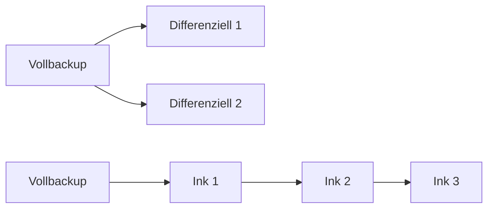

---
# Identity (stable; never change after publishing)
id: ap1-0315
slug: "differenziell-vs-inkrementell-backup"

# Display
title: "Differenzielles vs. inkrementelles Backup"

# Classification / navigation (machine-side)
module: "IT-Sicherheit und Datenschutz, Ergonomie"
topics: ["backup", "datensicherung"]
tags: ["ap1", "backup", "grundlagen", "vergleich"]

# Flashcard payload
card:
  type: basic
  question: "Wie unterscheiden sich differenzielles und inkrementelles Backup?"
  answer: "Differenziell: sichert alle Änderungen seit dem letzten Vollbackup. Inkrementell: sichert nur Änderungen seit dem letzten Backup. Wiederherstellung: differenziell einfacher, inkrementell aufwendiger."
  examples: []

# Lifecycle
status: published       # draft | published | deprecated
created: "2026-03-27"
updated: "2026-03-27"
---

## Differenzielles vs. inkrementelles Backup
Differenzielle und inkrementelle Backups sind zwei Strategien zur Datensicherung, die Speicherplatz und Zeit sparen sollen.

Der Unterschied liegt darin, **welche Daten gesichert werden** und **wie die Wiederherstellung funktioniert**.

## Kernerklärung

### Vergleich

| Kriterium              | Differenzielles Backup                     | Inkrementelles Backup                     |
|-----------------------|-------------------------------------------|-------------------------------------------|
| Sicherung             | Änderungen seit letztem Vollbackup        | Änderungen seit letztem Backup             |
| Speicherbedarf        | steigt mit der Zeit                       | sehr gering                               |
| Geschwindigkeit       | mittel                                    | schnell                                   |
| Wiederherstellung     | einfach (Voll + letztes diff.)            | aufwendig (Voll + alle inkrementellen)     |
| Risiko                | geringer                                  | höher (bei fehlendem Backupproblem)        |

### Funktionsweise

- **Differenziell:** immer Bezug auf das letzte Vollbackup  
- **Inkrementell:** Kette von Backups baut aufeinander auf  

## Praktisches Beispiel
- Tag 1: Vollbackup  
- Tag 2: Datei geändert  
- Tag 3: weitere Änderung  

Differenziell: Tag 3 enthält Änderungen von Tag 2 + 3  
Inkrementell: Tag 2 enthält Änderung von Tag 2, Tag 3 nur Änderung von Tag 3  

## Prüfungsrelevanz (AP1)

### Typische Prüfungsfragen
- Unterschied differenziell vs. inkrementell?  
- Welche Methode ist schneller bei der Wiederherstellung?  

### Antworten auf die typischen Prüfungsfragen
- Differenziell sichert seit letztem Vollbackup  
- Inkrementell sichert seit letztem Backup  
- Wiederherstellung: differenziell einfacher, inkrementell komplexer  

## Merksatz
**Differenziell = mehr Daten, aber einfache Wiederherstellung.  
Inkrementell = wenig Daten, aber komplexe Wiederherstellung.**