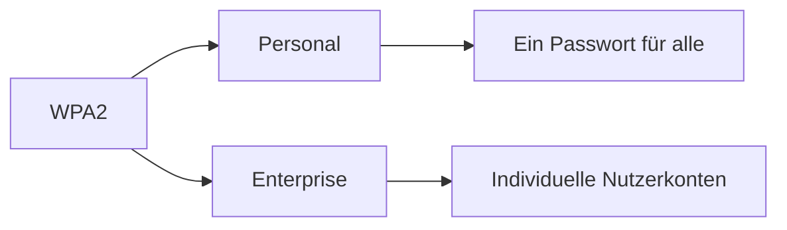

---
# Identity (stable; never change after publishing)
id: ap1-0321
slug: "wpa2-personal-vs-enterprise"

# Display
title: "WPA2-Personal vs. WPA2-Enterprise"

# Classification / navigation (machine-side)
module: "IT-Sicherheit und Datenschutz, Ergonomie"
topics: ["wlan", "verschluesselung", "authentifizierung"]
tags: ["ap1", "netzwerk", "sicherheit"]

# Flashcard payload
card:
  type: basic
  question: "Was sind je 2 Vor- und Nachteile der Sicherheitstypen WPA2-Personal und WPA2-Enterprise?"
  answer: "WPA2-Personal: + einfach zu implementieren, weit verbreitet; − unsicher bei vielen Nutzern, Passwortwechsel aufwendig. WPA2-Enterprise: + hohe Sicherheit, zentrale Verwaltung; − hoher Aufwand, RADIUS-Server nötig."
  examples: []

# Lifecycle
status: published       # draft | published | deprecated
created: "2026-03-27"
updated: "2026-03-27"
---

## WPA2-Personal vs. WPA2-Enterprise
WPA2 ist ein Sicherheitsstandard für WLAN-Netzwerke.

Es gibt zwei Varianten:
- **WPA2-Personal (PSK)**
- **WPA2-Enterprise**

Beide unterscheiden sich vor allem in Sicherheit und Verwaltungsaufwand.

## Kernerklärung

### Vergleich WPA2-Personal vs. WPA2-Enterprise

| Kriterium            | WPA2-Personal (PSK)                  | WPA2-Enterprise                  |
|----------------------|-------------------------------------|----------------------------------|
| Authentifizierung     | gemeinsames Passwort                | individuelle Zugangsdaten        |
| Sicherheit            | geringer bei vielen Nutzern         | sehr hoch                        |
| Verwaltung            | einfach                             | zentral (z. B. über Server)      |
| Einsatz               | kleine Netzwerke / Zuhause          | Unternehmen / Organisationen     |

### Vorteile & Nachteile

#### WPA2-Personal
**Vorteile:**
- leicht zu implementieren  
- weit verbreitet  

**Nachteile:**
- unsicher in größeren Umgebungen (Passwort bekannt)  
- Passwortwechsel für alle Geräte aufwendig  

#### WPA2-Enterprise
**Vorteile:**
- sehr hohe Sicherheit  
- zentrale Verwaltung von Nutzern und Geräten  

**Nachteile:**
- hoher technischer Aufwand  
- zusätzlicher Server (z. B. RADIUS) notwendig  

## Praktisches Beispiel

- **WPA2-Personal:**  
  Heim-WLAN → ein gemeinsames WLAN-Passwort für alle Geräte  

- **WPA2-Enterprise:**  
  Firmen-WLAN → jeder Mitarbeiter hat eigene Zugangsdaten  

## Prüfungsrelevanz (AP1)

### Typische Prüfungsfragen
- Unterschied zwischen WPA2-Personal und Enterprise?  
- Nenne Vor- und Nachteile beider Varianten  

### Antworten auf die typischen Prüfungsfragen
- Personal: einfach, aber unsicher bei vielen Nutzern  
- Enterprise: sicher, aber aufwendig (z. B. RADIUS notwendig)  

## Merksatz
**WPA2-Personal = einfach, WPA2-Enterprise = sicher.**