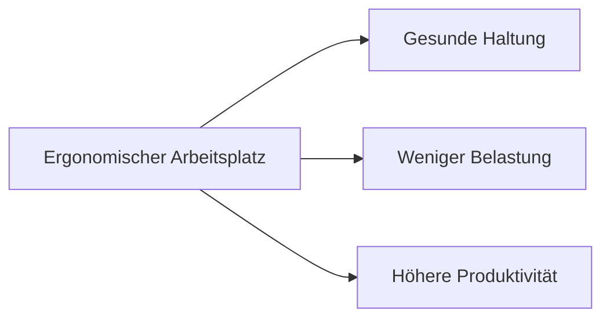

---
# Identity (stable; never change after publishing)
id: ap1-0323
slug: "ergonomischer-arbeitsplatz"

# Display
title: "Ergonomischer PC-Arbeitsplatz"

# Classification / navigation (machine-side)
module: "IT-Sicherheit und Datenschutz, Ergonomie"
topics: ["ergonomie", "arbeitsplatz", "gesundheit"]
tags: ["ap1", "grundlagen", "arbeitsplatzgestaltung"]

# Flashcard payload
card:
  type: basic
  question: "Welche Bedingungen muss ein ergonomischer PC-Arbeitsplatz erfüllen?"
  answer: "Monitor leicht unter Augenhöhe, Abstand ca. 50 cm, keine Blendung, höhenverstellbar, 90°-Winkel bei Armen/Beinen, genügend Beinfreiheit und natürliche Körperhaltung."
  examples: []

# Lifecycle
status: published       # draft | published | deprecated
created: "2026-03-28"
updated: "2026-03-28"
---

## Ergonomischer PC-Arbeitsplatz
Ein ergonomischer Arbeitsplatz sorgt für gesundes und effizientes Arbeiten am Computer.

Er basiert auf Richtlinien (z. B. EU-Richtlinie 90/270/EWG), die Mindestanforderungen festlegen.

## Kernerklärung

### Wichtige Anforderungen

- **Monitorposition:**
  - obere Bildschirmzeile leicht unter Augenhöhe  
  - Mindestabstand ca. **50 cm**  

- **Sicht & Darstellung:**
  - keine störenden Reflexionen oder Blendungen  
  - Bildschirm frei positionierbar (dreh- und neigbar)  

- **Arbeitsplatzanpassung:**
  - Bildschirm, Tisch und Stuhl an Körpergröße anpassbar  

- **Körperhaltung:**
  - 90°-Winkel bei:
    - Ober-/Unterarm  
    - Ober-/Unterschenkel  
  - natürliche Sitzhaltung  

- **Bewegungsfreiheit:**
  - ausreichend Platz für Beine  
  - freier Stand des Arbeitsplatzes  

## Praktisches Beispiel

Ein Mitarbeiter richtet seinen Arbeitsplatz ein:

- Monitor auf Augenhöhe angepasst  
- Abstand ca. 60 cm  
- Stuhlhöhe so eingestellt, dass Arme im 90°-Winkel sind  

Ergebnis: weniger Rücken- und Nackenschmerzen.

## Prüfungsrelevanz (AP1)

### Typische Prüfungsfragen
- Nenne Anforderungen an einen ergonomischen Arbeitsplatz  
- Welche Rolle spielt die Körperhaltung?  

### Antworten auf die typischen Prüfungsfragen
- richtige Monitorhöhe und Abstand  
- keine Blendung  
- 90°-Winkel bei Armen und Beinen  
- genügend Bewegungsfreiheit  

## Merksatz
**Ergonomie = richtig sitzen, richtig sehen, gesund arbeiten.**