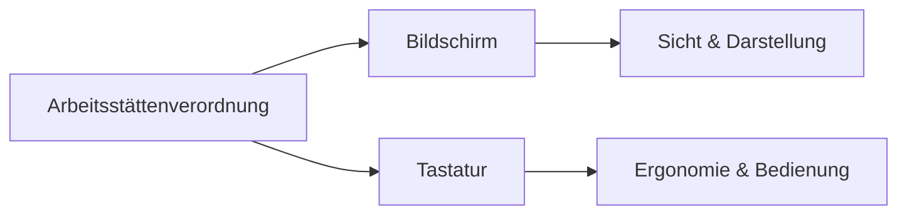

---
# Identity (stable; never change after publishing)
id: ap1-0324
slug: "arbeitsstaettenverordnung-bildschirm-tastatur"

# Display
title: "Arbeitsstättenverordnung: Bildschirm & Tastatur"

# Classification / navigation (machine-side)
module: "IT-Sicherheit und Datenschutz, Ergonomie"
topics: ["ergonomie", "arbeitsplatz", "arbstaettv"]
tags: ["ap1", "richtlinien", "gesundheit"]

# Flashcard payload
card:
  type: basic
  question: "Welche Aussagen trifft die Arbeitsstättenverordnung (ArbStättV) in Bezug auf Bildschirm und Tastatur?"
  answer: "Bildschirm: scharf, flimmerfrei, verstellbar, keine Reflexionen, Helligkeit/Kontrast einstellbar. Tastatur: getrennt, neigbar, reflexionsarm, ergonomisch und gut lesbar."
  examples: []

# Lifecycle
status: published       # draft | published | deprecated
created: "2026-03-28"
updated: "2026-03-28"
---

## Arbeitsstättenverordnung: Bildschirm & Tastatur
Die Arbeitsstättenverordnung (ArbStättV) regelt die ergonomische Gestaltung von Bildschirmarbeitsplätzen.

Sie enthält konkrete Anforderungen an **Bildschirmgeräte und Tastaturen**, um gesundes Arbeiten zu gewährleisten.

## Kernerklärung

### Anforderungen an den Bildschirm

- Zeichen müssen:
  - **scharf, deutlich und ausreichend groß** sein  
- Darstellung:
  - **stabil, flimmerfrei und unverzerrt**  
- **Helligkeit und Kontrast einstellbar**  
- Arbeitsplatz:
  - frei von **Reflexionen und Blendungen**  
- Bildschirm:
  - **frei beweglich, dreh- und neigbar**  
  - unabhängig vom Arbeitsplatz positionierbar  

### Anforderungen an die Tastatur

- **Getrennt vom Bildschirm** (flexible Positionierung)  
- **Neigbar** für ergonomische Haltung  
- **Auflagefläche für Hände** vorhanden  
- **Reflexionsarme Oberfläche**  
- Beschriftung:
  - gut lesbar  
  - deutlich vom Hintergrund abgehoben  

### Übersicht

| Komponente | Anforderungen |
|------------|-------------|
| Bildschirm | scharf, flimmerfrei, einstellbar, blendfrei |
| Tastatur   | getrennt, neigbar, ergonomisch, gut lesbar |

## Praktisches Beispiel

Ein Arbeitsplatz wird nach ArbStättV eingerichtet:

- Monitor ohne Spiegelungen und höhenverstellbar  
- Tastatur separat und leicht geneigt  
- Zeichen gut lesbar und kontrastreich  

Ergebnis: weniger Augenbelastung und ergonomisches Arbeiten.

## Prüfungsrelevanz (AP1)

### Typische Prüfungsfragen
- Welche Anforderungen stellt die ArbStättV an Bildschirmgeräte?  
- Welche Eigenschaften muss eine Tastatur erfüllen?  

### Antworten auf die typischen Prüfungsfragen
- Bildschirm: flimmerfrei, einstellbar, keine Blendung  
- Tastatur: getrennt, neigbar, ergonomisch, gut lesbar  

## Merksatz
**Guter Bildschirm = gutes Sehen, gute Tastatur = entspanntes Arbeiten.**