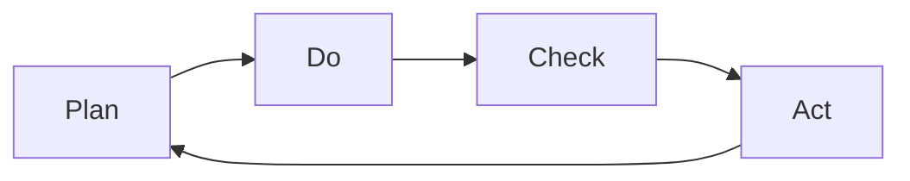

---
# Identity (stable; never change after publishing)
id: ap1-0325
slug: "pdca-zyklus-qualitaetsmanagement"

# Display
title: "PDCA-Zyklus im Qualitätsmanagement"

# Classification / navigation (machine-side)
module: "IT-Sicherheit und Datenschutz, Ergonomie"
topics: ["pdca", "kontinuierliche-verbesserung"]
tags: ["ap1", "prozesse", "qm"]

# Flashcard payload
card:
  type: basic
  question: "Beschreibe den PDCA-Zyklus und seine einzelnen Schritte."
  answer: "Ein kontinuierlicher Verbesserungsprozess im Qualitätsmanagement bestehend aus Plan (Planen), Do (Umsetzen), Check (Überprüfen) und Act (Verbessern)."
  examples: []

# Lifecycle
status: published
created: "2026-03-28"
updated: "2026-03-28"
---

## PDCA-Zyklus im Qualitätsmanagement
Der PDCA-Zyklus ist ein Modell zur **kontinuierlichen Verbesserung (KVP)** von Prozessen im Qualitätsmanagement.

Er beschreibt einen **wiederkehrenden Regelkreis**, mit dem Prozesse geplant, umgesetzt, überprüft und optimiert werden.

## Kernerklärung

Der PDCA-Zyklus besteht aus vier Schritten:

| Phase | Bedeutung |
|------|----------|
| **Plan** | Analyse, Planung und Zieldefinition |
| **Do** | Umsetzung der geplanten Maßnahmen |
| **Check** | Überprüfung (Soll-Ist-Vergleich) |
| **Act** | Maßnahmen anpassen und verbessern |

### Ablauf

Der Zyklus wiederholt sich kontinuierlich, um Prozesse stetig zu verbessern.

## Praktisches Beispiel

Ein IT-Unternehmen möchte die Fehlerquote in Software reduzieren:

- **Plan:** Analyse der Fehlerursachen, Ziel: weniger Bugs  
- **Do:** Einführung von Code-Reviews  
- **Check:** Auswertung der Fehlerquote nach Umsetzung  
- **Act:** Anpassung der Prozesse (z. B. zusätzliche Tests)  

Ergebnis: kontinuierliche Verbesserung der Softwarequalität

## Prüfungsrelevanz (AP1)

### Typische Prüfungsfragen
- Was bedeutet PDCA?  
- Welche Schritte umfasst der PDCA-Zyklus?  
- Wofür wird der PDCA-Zyklus eingesetzt?  

### Antworten auf die typischen Prüfungsfragen
- PDCA steht für Plan, Do, Check, Act  
- Es ist ein kontinuierlicher Verbesserungsprozess  
- Ziel ist die Optimierung von Prozessen im Qualitätsmanagement  

## Merksatz
**PDCA = Planen → Umsetzen → Prüfen → Verbessern → wiederholen.**