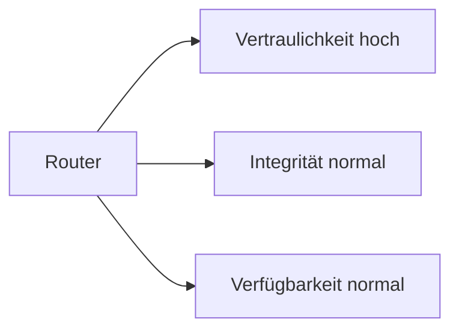

---
# Identity (stable; never change after publishing)
id: ap1-0331
slug: "router-schutzziele-bsi"

# Display
title: "Schutzziele und Schutzbedarf eines Routers (BSI)"

# Classification / navigation (machine-side)
module: "IT-Sicherheit und Datenschutz, Ergonomie"
topics: ["schutzziele", "bsi", "router"]
tags: ["ap1", "it-sicherheit", "cia"]

# Flashcard payload
card:
  type: basic
  question: "Welcher Schutzbedarf bzw. welche Schutzziele gelten für einen Router nach BSI IT-Grundschutz?"
  answer: "Vertraulichkeit: hoch, Integrität: normal, Verfügbarkeit: normal."
  examples: []

# Lifecycle
status: published       # draft | published | deprecated
created: "2026-03-28"
updated: "2026-03-28"
---

## Schutzziele und Schutzbedarf eines Routers (BSI)

Router sind zentrale Netzwerkkomponenten und müssen entsprechend abgesichert werden.  
Dabei werden die drei klassischen Schutzziele betrachtet.

## Kernerklärung

### Schutzziele (CIA-Prinzip)

| Schutzziel | Schutzbedarf | Begründung |
|-----------|-------------|-----------|
| **Vertraulichkeit** | hoch | Über Router werden auch sensible Daten übertragen → Abhören muss verhindert werden |
| **Integrität** | normal | Fehlerhafte Daten können meist erkannt werden → geringeres Risiko |
| **Verfügbarkeit** | normal | Kurzzeitiger Ausfall ist oft tolerierbar |

### Zusammenhang

## Praktisches Beispiel

Ein Unternehmensrouter:

- Verschlüsselt Daten (VPN) → schützt Vertraulichkeit  
- Prüfsummen sichern Datenintegrität  
- Redundante Systeme erhöhen Verfügbarkeit  

## Prüfungsrelevanz (AP1)

### Typische Prüfungsfragen
- Welche Schutzziele gibt es?  
- Wie ist der Schutzbedarf eines Routers?  

### Antworten auf die typischen Prüfungsfragen
- Vertraulichkeit, Integrität, Verfügbarkeit  
- Router: Vertraulichkeit hoch, Integrität & Verfügbarkeit normal  

## Merksatz
**Beim Router ist Datenschutz wichtiger als ständige Verfügbarkeit.**