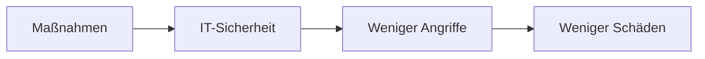

---
# Identity (stable; never change after publishing)
id: ap1-0332
slug: "massnahmen-it-sicherheit-erhoehen"

# Display
title: "Maßnahmen zur Erhöhung der IT-Sicherheit"

# Classification / navigation (machine-side)
module: "IT-Sicherheit und Datenschutz, Ergonomie"
topics: ["sicherheitsmassnahmen", "netzwerksicherheit"]
tags: ["ap1", "it-sicherheit", "schutz"]

# Flashcard payload
card:
  type: basic
  question: "Welche Maßnahmen sind geeignet, um Schäden an der IT-Infrastruktur zu vermeiden bzw. die Sicherheit der IT-Systeme zu erhöhen?"
  answer: "Datenverschlüsselung, Netzsegmentierung (VLAN), Firewalls/Endpoint-Security, Rechtekonzepte, regelmäßige Updates, Logging & Audits, starke Authentifizierung (MFA), organisatorische Regeln und Mitarbeiterschulungen."
  examples: []

# Lifecycle
status: published       # draft | published | deprecated
created: "2026-03-28"
updated: "2026-03-28"
---

## Maßnahmen zur Erhöhung der IT-Sicherheit

IT-Sicherheit umfasst technische und organisatorische Maßnahmen, um Systeme vor Angriffen und Schäden zu schützen.

## Kernerklärung

Wichtige Maßnahmen zur Erhöhung der IT-Sicherheit:

- **Datenverschlüsselung** (z. B. Datenträger, Kommunikation)
- **Netzwerksegmentierung** (z. B. VLANs)
- **Firewall- und Endpoint-Security-Konzepte**
- **Rechte- und Rollenkonzepte** für Benutzer und Admins
- **Regelmäßige Updates und Patches**
- **Logging und Auditing** (z. B. Penetrationstests)
- **Starke Authentifizierung** (Passwortrichtlinien, MFA)
- **Organisatorische Maßnahmen** (z. B. Vier-Augen-Prinzip)
- **Mitarbeiterschulungen** zur Sensibilisierung

### Zusammenhang

## Praktisches Beispiel

Ein Unternehmen schützt seine IT-Systeme durch:

- Firewall + VLAN-Trennung  
- MFA für alle Benutzer  
- Regelmäßige Updates  

Ergebnis: deutlich geringeres Risiko für Angriffe

## Prüfungsrelevanz (AP1)

### Typische Prüfungsfragen
- Nenne Maßnahmen zur IT-Sicherheit  
- Warum sind Schulungen wichtig?  

### Antworten auf die typischen Prüfungsfragen
- z. B. Verschlüsselung, Firewalls, MFA, Updates  
- Mitarbeiter erkennen Bedrohungen besser und vermeiden Fehler  

## Merksatz
**IT-Sicherheit = Technik + Organisation + Mensch.**