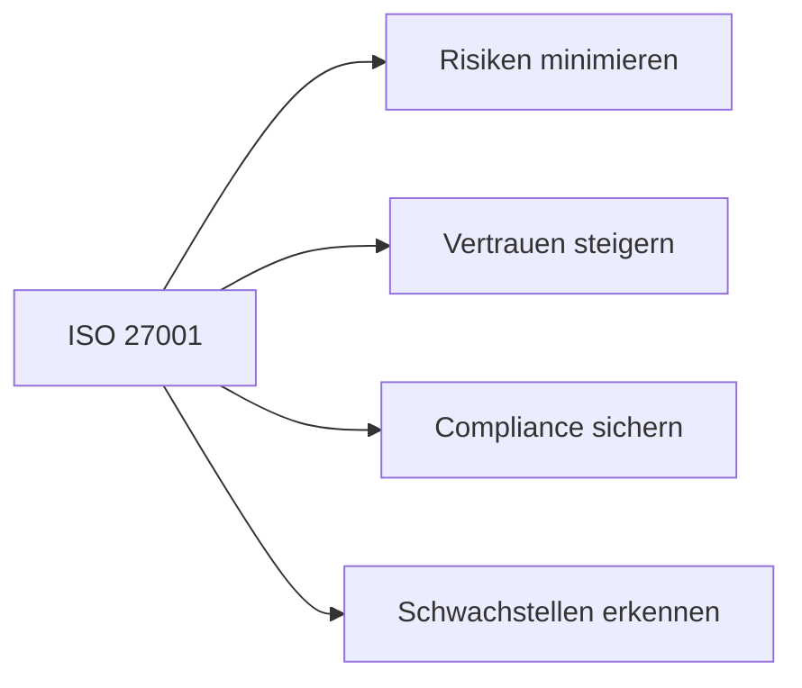

---
# Identity (stable; never change after publishing)
id: ap1-0205
slug: "iso-iec-27001-vorteile"

# Display
title: "Vorteile der ISO/IEC 27001 Zertifizierung"

# Classification / navigation (machine-side)
module: "IT-Sicherheit und Datenschutz, Ergonomie"
topics: ["iso-27001", "isms", "zertifizierung"]
tags: ["ap1", "sicherheit", "management", "risiken"]

# Flashcard payload
card:
  type: basic
  question: "Nenne die wesentlichen Vorteile einer ISO/IEC 27001 Zertifizierung für Unternehmen."
  answer: "Minimierung von IT-Risiken, Abschätzung von Schäden, Wettbewerbsvorteil, Vertrauenssteigerung, Sicherstellung von Compliance und Aufdeckung von Schwachstellen."
  examples: []

# Lifecycle
status: published       # draft | published | deprecated
created: "2026-03-25"
updated: "2026-03-25"
---

## Vorteile der ISO/IEC 27001 Zertifizierung
Die ISO/IEC 27001 ist ein internationaler Standard für Informationssicherheits-Managementsysteme (ISMS).

Unternehmen können sich zertifizieren lassen, um ihre IT-Sicherheit systematisch zu verbessern.

## Kernerklärung

### Ziele der ISO/IEC 27001
- Einführung eines **ISMS (Informationssicherheits-Managementsystems)**  
- Kontinuierliche Verbesserung der IT-Sicherheit  
- Systematisches Management von Risiken  

### Wichtige Vorteile

| Vorteil                     | Bedeutung |
|----------------------------|----------|
| Risikominimierung          | IT-Risiken werden erkannt und reduziert |
| Schadensabschätzung        | Mögliche Folgen werden frühzeitig bewertet |
| Wettbewerbsvorteil         | Anerkannter internationaler Standard |
| Vertrauenssteigerung       | Kunden und Partner haben mehr Vertrauen |
| Compliance                 | Gesetzliche Anforderungen werden erfüllt |
| Schwachstellenanalyse      | Sicherheitslücken werden erkannt |

## Praktisches Beispiel
Ein Unternehmen führt ISO 27001 ein:

- Identifiziert Sicherheitsrisiken  
- Führt Maßnahmen (z. B. Zugriffskontrollen) ein  
- Wird zertifiziert  

Ergebnis: Höhere Sicherheit und besseres Image am Markt  

## Prüfungsrelevanz (AP1)

### Typische Prüfungsfragen
- Was ist ISO/IEC 27001?
- Welche Vorteile bringt eine Zertifizierung?
- Warum ist ein ISMS wichtig?

### Antworten auf die typischen Prüfungsfragen
- Ein internationaler Standard für Informationssicherheit.  
- Risikominimierung, Vertrauen, Wettbewerbsvorteile usw.  
- Es sorgt für strukturierte und kontinuierliche Sicherheit.

## Merksatz
**ISO 27001 = Systematische Sicherheit + Vertrauen + Wettbewerbsvorteil.**