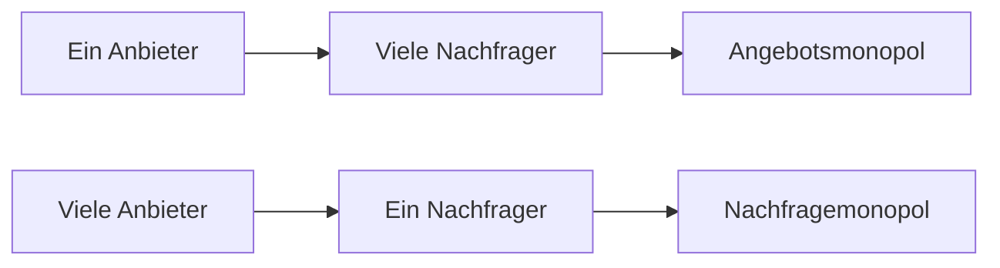

---
# Identity (stable; never change after publishing)
id: ap1-0128
slug: monopol-marktform

# Display
title: Marktform Monopol

# Classification / navigation (machine-side)
module: "Informieren und Beraten von Kunden und Kundinnen"
topics: ["Marktformen", "Volkswirtschaft"]
tags: ["definition", "prüfungsrelevant"]

# Flashcard payload
card:
  type: definition
  question: "Wie wird die Marktform des Monopols definiert?"
  answer: |
    Ein Monopol ist eine Marktform, bei der es nur einen Anbieter oder nur einen Nachfrager gibt.

    - Angebotsmonopol: Ein Anbieter steht vielen Nachfragern gegenüber.
    - Nachfragemonopol: Ein Nachfrager steht vielen Anbietern gegenüber.

    Der Monopolist besitzt eine marktbeherrschende Stellung und kann Angebot und Preis weitgehend bestimmen.

    Eine Sonderform ist das zweiseitige Monopol, bei dem es genau einen Anbieter und genau einen Nachfrager gibt.
  examples:
    - "Angebotsmonopol: Ein Energieversorger ist der einzige Anbieter in einer Region."
    - "Nachfragemonopol: Ein großer Konzern ist der einzige Käufer eines Rohstoffs."

# Lifecycle
status: published
created: "2026-03-10"
updated: "2026-03-10"
---

## Marktform Monopol

Ein **Monopol** liegt vor, wenn der Markt von **nur einem Marktteilnehmer auf einer Seite dominiert wird**.  
Dieser Teilnehmer besitzt eine **marktbeherrschende Stellung** und kann daher Preise und Angebotsmengen stark beeinflussen.

## Arten von Monopolen

| Marktform | Beschreibung |
|---|---|
| Angebotsmonopol | Ein Anbieter trifft auf viele Nachfrager |
| Nachfragemonopol | Ein Nachfrager trifft auf viele Anbieter |
| Zweiseitiges Monopol | Genau ein Anbieter und genau ein Nachfrager |

## Einordnung der Marktformen

Die Marktform ergibt sich aus der Anzahl von **Anbietern** und **Nachfragern**.

| Anbieter \ Nachfrager | Ein Nachfrager | Wenige Nachfrager | Viele Nachfrager |
|---|---|---|---|
| Ein Anbieter | Zweiseitiges Monopol | Beschränktes Angebotsmonopol | Angebotsmonopol |
| Wenige Anbieter | Beschränktes Nachfragemonopol | Zweiseitiges Oligopol | Angebotsoligopol |
| Viele Anbieter | Nachfragemonopol | Nachfrageoligopol | Polypol |

## Prüfungsrelevanz (AP1)

In Prüfungen wird häufig erwartet:

- **Definition eines Monopols**
- **Unterschied zwischen Angebots- und Nachfragemonopol**
- **Einordnung in Marktformen**

Merksatz:

> **Monopol = Ein Marktteilnehmer dominiert den Markt.**

## Vereinfachte Darstellung

## Häufige Prüfungsfalle

| Fehler | Korrektur |
|---|---|
| Monopol bedeutet nur „ein Anbieter“ | Es kann auch ein **Nachfragemonopol** geben |
| Monopol = keine Konkurrenz | Es gibt **keine direkte Konkurrenz**, aber oft staatliche Regulierung |
| Monopol bestimmt immer jeden Preis | Der Preis kann beeinflusst werden, aber **Nachfrage und Regulierung wirken trotzdem** |