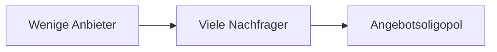

---
# Identity (stable; never change after publishing)
id: ap1-0129
slug: angebotsoligopol

# Display
title: Angebotsoligopol

# Classification / navigation (machine-side)
module: "Informieren und Beraten von Kunden und Kundinnen"
topics: ["Marktformen", "Volkswirtschaft"]
tags: ["definition", "prüfungsrelevant"]

# Flashcard payload
card:
  type: definition
  question: "Wann spricht man in der Wirtschaft von einem Angebotsoligopol?"
  answer: |
    Von einem Angebotsoligopol spricht man, wenn wenige Anbieter vielen Nachfragern gegenüberstehen.

    Die wenigen Anbieter besitzen einen großen Einfluss auf den Markt und können Preise und Angebote stark beeinflussen.
  examples:
    - "Mobilfunkmarkt mit wenigen großen Netzbetreibern."
    - "Energiemarkt mit wenigen großen Stromanbietern."

# Lifecycle
status: published
created: "2026-03-10"
updated: "2026-03-10"
---

## Angebotsoligopol

Ein **Angebotsoligopol** ist eine Marktform, bei der **wenige Anbieter** auf **viele Nachfrager** treffen.  
Da nur wenige Unternehmen den Markt dominieren, haben diese **einen erheblichen Einfluss auf Preis und Angebot**.

## Einordnung der Marktformen

Die Marktform ergibt sich aus der Anzahl von **Anbietern** und **Nachfragern**.

| Anbieter \ Nachfrager | Ein Nachfrager | Wenige Nachfrager | Viele Nachfrager |
|---|---|---|---|
| Ein Anbieter | Zweiseitiges Monopol | Beschränktes Angebotsmonopol | Angebotsmonopol |
| Wenige Anbieter | Beschränktes Nachfragemonopol | Zweiseitiges Oligopol | **Angebotsoligopol** |
| Viele Anbieter | Nachfragemonopol | Nachfrageoligopol | Polypol |

## Beispiele aus der Praxis

Typische Märkte mit Angebotsoligopol:

- **Mobilfunkmarkt** (z. B. wenige große Netzbetreiber)
- **Energiemarkt**
- **Flugzeughersteller**
- **Automobilindustrie** in manchen Ländern

Diese Unternehmen beobachten sich gegenseitig stark, da **Preisänderungen eines Unternehmens oft direkte Reaktionen der Konkurrenz auslösen**.

## Prüfungsrelevanz (AP1)

Typische Prüfungsfrage:

> Wann spricht man von einem Angebotsoligopol?

Erwartete Kernaussage:

- **Wenige Anbieter**
- **Viele Nachfrager**

Merksatz:

> **Oligopol = wenige Anbieter oder Nachfrager dominieren den Markt.**

## Vereinfachte Darstellung

## Häufige Prüfungsfalle

| Fehler | Korrektur |
|---|---|
| Oligopol bedeutet nur „zwei Anbieter“ | Oligopol bedeutet **wenige Anbieter (mehr als einer)** |
| Oligopol = Monopol | Beim Oligopol gibt es **mehrere Anbieter**, beim Monopol nur **einen** |
| Anbieter haben keinen Einfluss auf Preise | In einem Oligopol können Anbieter **starken Markteinfluss** haben |