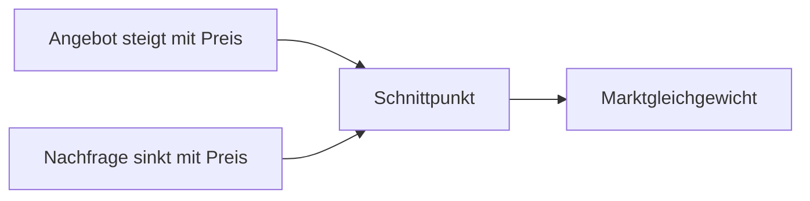

---
# Identity (stable; never change after publishing)
id: ap1-0131
slug: marktgleichgewicht

# Display
title: Marktgleichgewicht

# Classification / navigation (machine-side)
module: "Informieren und Beraten von Kunden und Kundinnen"
topics: ["Volkswirtschaft", "Marktmechanismus"]
tags: ["definition", "prüfungsrelevant"]

# Flashcard payload
card:
  type: definition
  question: "Welche Kriterien müssen erfüllt sein für ein Marktgleichgewicht?"
  answer: |
    Ein Marktgleichgewicht liegt vor, wenn die angebotene Menge und die nachgefragte Menge eines Gutes übereinstimmen.

    Dabei entsteht ein Gleichgewichtspreis, zu dem genau die Menge angeboten wird, die auch nachgefragt wird.
  examples:
    - "Ein Produkt kostet 10 €. Zu diesem Preis entspricht die angebotene Menge genau der nachgefragten Menge."

# Lifecycle
status: published
created: "2026-03-10"
updated: "2026-03-10"
---

## Marktgleichgewicht

Das **Marktgleichgewicht** beschreibt einen Zustand auf einem Markt, bei dem **Angebot und Nachfrage übereinstimmen**.  
Zu diesem Punkt gibt es **weder einen Angebotsüberschuss noch einen Nachfrageüberschuss**.

Der Preis, bei dem dies geschieht, wird **Gleichgewichtspreis** genannt.

## Voraussetzungen für ein Marktgleichgewicht

| Kriterium | Bedeutung |
|---|---|
| Angebot | Die Menge an Gütern oder Dienstleistungen, die Anbieter verkaufen möchten |
| Nachfrage | Die Menge an Gütern oder Dienstleistungen, die Käufer erwerben möchten |
| Gleichgewichtspreis | Preis, bei dem Angebot und Nachfrage gleich groß sind |
| Gleichgewichtsmenge | Menge, die bei diesem Preis gehandelt wird |

## Darstellung im Angebots-Nachfrage-Modell

## Wirtschaftliche Bedeutung

Wenn der Markt **nicht im Gleichgewicht** ist, entstehen zwei typische Situationen:

| Situation | Erklärung |
|---|---|
| Angebotsüberschuss | Zu viele Güter werden angeboten → Preis sinkt |
| Nachfrageüberschuss | Nachfrage ist größer als Angebot → Preis steigt |

Durch diese Preisbewegungen tendiert der Markt wieder zum **Gleichgewichtspunkt**.

## Prüfungsrelevanz (AP1)

Typische Erwartung in der Prüfung:

- **Angebot = Nachfrage**
- **Gleichgewichtspreis**
- **Gleichgewichtsmenge**

Merksatz:

> **Marktgleichgewicht = Angebot und Nachfrage stimmen überein.**

## Häufige Prüfungsfalle

| Fehler | Korrektur |
|---|---|
| Gleichgewicht bedeutet maximaler Gewinn | Es beschreibt nur das **Gleichgewicht von Angebot und Nachfrage** |
| Gleichgewicht bedeutet gleiche Preise überall | Es gilt nur **für einen bestimmten Markt** |
| Gleichgewicht ist dauerhaft stabil | Änderungen bei Angebot oder Nachfrage verschieben das Gleichgewicht |