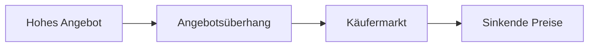

---
# Identity (stable; never change after publishing)
id: ap1-0132
slug: kaeufermarkt

# Display
title: Käufermarkt

# Classification / navigation (machine-side)
module: "Informieren und Beraten von Kunden und Kundinnen"
topics: ["Volkswirtschaft", "Marktmechanismus"]
tags: ["definition", "prüfungsrelevant"]

# Flashcard payload
card:
  type: definition
  question: "Wann spricht man von einem Käufermarkt?"
  answer: |
    Von einem Käufermarkt spricht man, wenn das Angebot größer ist als die Nachfrage.

    Dadurch befindet sich die Käuferseite in einer stärkeren Position gegenüber den Verkäufern.
    Als Folge sinken häufig die Preise, da Anbieter versuchen, ihre Waren zu verkaufen.
  examples:
    - "Viele Händler bieten ein Produkt an, aber nur wenige Kunden kaufen es."
    - "Überangebot an Erdbeeren auf dem Markt führt zu sinkenden Preisen."

# Lifecycle
status: published
created: "2026-03-10"
updated: "2026-03-10"
---

## Käufermarkt

Ein **Käufermarkt** beschreibt eine Marktsituation, in der **die Käufer mehr Einfluss auf den Markt haben als die Verkäufer**.  
Dies entsteht, wenn **mehr Waren angeboten werden als tatsächlich nachgefragt werden**.

Dadurch entsteht ein **Angebotsüberhang (Überangebot)**.

## Marktmechanismus

| Situation | Folge |
|---|---|
| Angebot > Nachfrage | Käufer haben mehr Auswahl |
| Anbieter konkurrieren stärker | Preise sinken |
| Verkäufer versuchen Käufer zu gewinnen | Rabatte oder bessere Konditionen |

## Beispiel aus der Praxis

Ein typisches Beispiel ist ein **Überangebot an saisonalen Produkten**:

- Es werden sehr viele **Erdbeeren** geerntet.
- Die Nachfrage der Kunden bleibt jedoch gleich.
- Händler müssen ihre Preise senken, um die Ware zu verkaufen.

## Zusammenhang mit Angebot und Nachfrage

## Prüfungsrelevanz (AP1)

Typische Kernaussage:

- **Angebot größer als Nachfrage**
- **Käufer in stärkerer Marktposition**
- **Preise sinken häufig**

Merksatz:

> **Käufermarkt = Überangebot → Käufer bestimmen stärker den Markt.**

## Häufige Prüfungsfalle

| Fehler | Korrektur |
|---|---|
| Käufermarkt = hohe Nachfrage | Käufermarkt entsteht durch **hohes Angebot** |
| Verkäufer bestimmen den Preis | In einem Käufermarkt haben **Käufer mehr Einfluss** |
| Käufermarkt = Marktgleichgewicht | Beim Käufermarkt gibt es **kein Gleichgewicht**, sondern ein Überangebot |