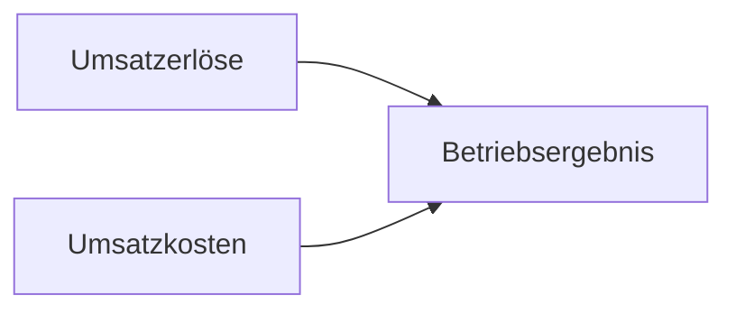

---
# Identity (stable; never change after publishing)
id: ap1-0138
slug: betriebsergebnis-beeinflussen

# Display
title: Betriebs­ergebnis positiv beeinflussen

# Classification / navigation (machine-side)
module: "Informieren und Beraten von Kunden und Kundinnen"
topics: ["Kostenrechnung", "Unternehmensführung"]
tags: ["definition", "prüfungsrelevant"]

# Flashcard payload
card:
  type: multi
  question: "Ein Betriebsergebnis errechnet sich aus den Umsatzerlösen minus den Umsatzkosten. Welche Sachverhalte können das Betriebsergebnis positiv beeinflussen?"
  answer: |
    Das Betriebsergebnis kann verbessert werden, indem Kosten reduziert oder Prozesse effizienter gestaltet werden.

    Mögliche Maßnahmen:

    - Wareneinkauf optimieren (z. B. bessere Einkaufspreise oder Rabatte)
    - Herstellungskosten senken (z. B. günstigere Materialien oder effizientere Produktion)
    - Verwaltungskosten reduzieren (z. B. durch Einsatz von Software)
    - Werbekosten senken (z. B. Nutzung günstigerer Marketingkanäle wie Social Media)
    - Personalkosten reduzieren durch höhere Produktivität
    - Fixkosten senken (z. B. Leasing statt Kauf von Fahrzeugen)
  examples:
    - "Ein Unternehmen handelt bessere Einkaufspreise bei Lieferanten aus."
    - "Digitale Software automatisiert Verwaltungsprozesse und spart Kosten."
    - "Marketing wird teilweise über Social Media statt teurer Werbung umgesetzt."

# Lifecycle
status: published
created: "2026-03-10"
updated: "2026-03-10"
---

## Betriebs­ergebnis positiv beeinflussen

Das **Betriebsergebnis** ergibt sich aus:

```
Betriebsergebnis = Umsatzerlöse − Umsatzkosten
```

Um das Betriebsergebnis zu verbessern, müssen entweder:

- **Kosten reduziert werden**
- **Effizienz gesteigert werden**

## Möglichkeiten zur Verbesserung

| Maßnahme | Beispiel |
|---|---|
| Wareneinkauf optimieren | Rabatte mit Lieferanten verhandeln |
| Herstellungskosten senken | günstigere Materialien einsetzen |
| Verwaltungskosten reduzieren | Einsatz von Software zur Automatisierung |
| Werbekosten senken | Marketing über Social Media statt teurer Werbung |
| Personalkosten senken | Produktivität steigern |
| Fixkosten reduzieren | Leasing statt Kauf von Fahrzeugen |

## Grundprinzip



Ziel eines Unternehmens ist es, **Umsatzkosten zu senken oder Erlöse zu erhöhen**, um das Betriebsergebnis zu verbessern.

## Prüfungsrelevanz (AP1)

Typische Prüfungsfrage:

> Welche Sachverhalte können das Betriebsergebnis positiv beeinflussen?

Erwartete Antworten sind **Maßnahmen zur Kostensenkung oder Effizienzsteigerung**, zum Beispiel:

- Wareneinkauf optimieren  
- Herstellungskosten senken  
- Verwaltungskosten reduzieren  
- Werbekosten reduzieren  
- Personalkosten senken  
- Fixkosten reduzieren  

## Merksatz

> **Betriebsergebnis steigt, wenn Kosten sinken oder Prozesse effizienter werden.**

## Häufige Prüfungsfalle

| Fehler | Korrektur |
|---|---|
| Nur Umsatz erhöhen | Auch **Kosten senken** verbessert das Ergebnis |
| Nur Produktion betrachten | Auch **Verwaltung, Marketing und Fixkosten** beeinflussen das Ergebnis |
| Personalkosten einfach streichen | Ziel ist **höhere Effizienz**, nicht nur weniger Personal |