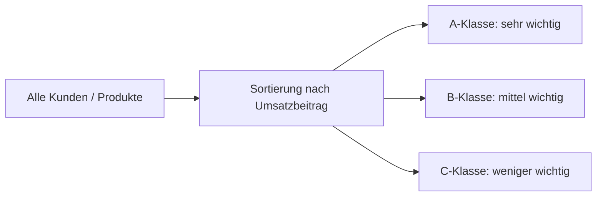

---
# Identity (stable; never change after publishing)
id: ap1-0141
slug: abc-analyse-controlling

# Display
title: ABC-Analyse im Controlling

# Classification / navigation (machine-side)
module: "Informieren und Beraten von Kunden und Kundinnen"
topics: ["Controlling", "Analyseverfahren"]
tags: ["definition", "prüfungsrelevant"]

# Flashcard payload
card:
  type: definition
  question: "Welchem Zweck dient eine ABC-Analyse im Unternehmens-Controlling?"
  answer: |
    Die ABC-Analyse dient dazu, Objekte (z. B. Kunden, Produkte oder Materialien) nach ihrer wirtschaftlichen Bedeutung zu klassifizieren.

    Dabei werden sie in drei Klassen eingeteilt:
    - A: sehr wichtiger Anteil am Gesamtergebnis
    - B: mittlerer Anteil
    - C: geringer Anteil

    Dadurch können Unternehmen erkennen, welche Faktoren den größten Beitrag zum Umsatz oder Erfolg leisten.
  examples:
    - "A-Kunden bringen den größten Teil des Umsatzes."
    - "C-Kunden tragen nur wenig zum Gesamtumsatz bei."

# Lifecycle
status: published
created: "2026-03-10"
updated: "2026-03-10"
---

## ABC-Analyse im Controlling

Die **ABC-Analyse** ist ein betriebswirtschaftliches **Analyseverfahren im Controlling**.  
Sie dient dazu, **Elemente nach ihrer wirtschaftlichen Bedeutung zu ordnen und zu priorisieren**.

Typische Analyseobjekte sind:

- Kunden
- Produkte
- Materialien
- Lieferanten

## Einteilung der Klassen

| Klasse | Bedeutung | Anteil am Erfolg |
|---|---|---|
| A | sehr wichtig | hoher Anteil am Umsatz oder Ergebnis |
| B | mittel wichtig | durchschnittlicher Beitrag |
| C | weniger wichtig | geringer Beitrag |

Dabei werden die Objekte meist **nach ihrem Beitrag zum Umsatz oder Gewinn sortiert**.

## Beispiel: Kundenanalyse

| Kundengruppe | Bedeutung |
|---|---|
| A-Kunden | wenige Kunden erzeugen einen großen Teil des Umsatzes |
| B-Kunden | mittlerer Beitrag zum Umsatz |
| C-Kunden | viele Kunden mit geringem Umsatzanteil |

Dieses Prinzip ähnelt häufig dem **Pareto-Prinzip (80/20-Regel)**.

## Prinzip der ABC-Analyse

## Nutzen im Controlling

Die ABC-Analyse hilft Unternehmen:

- **wichtige Kunden oder Produkte zu identifizieren**
- **Ressourcen gezielt einzusetzen**
- **Prioritäten im Management zu setzen**
- **strategische Entscheidungen zu unterstützen**

## Prüfungsrelevanz (AP1)

Typische Prüfungsfrage:

> Wozu dient eine ABC-Analyse?

Erwartete Kernaussage:

- **Einteilung von Objekten nach wirtschaftlicher Bedeutung**
- **Klassifizierung in A-, B- und C-Gruppen**

## Merksatz

> **ABC-Analyse = Priorisierung nach wirtschaftlicher Bedeutung.**

## Häufige Prüfungsfalle

| Fehler | Korrektur |
|---|---|
| ABC steht für drei unterschiedliche Analysen | Es ist **eine Analyse mit drei Klassen** |
| Nur Kunden können analysiert werden | Auch **Produkte, Materialien oder Lieferanten** |
| Alle Klassen sind gleich wichtig | **A-Klasse hat die höchste wirtschaftliche Bedeutung** |