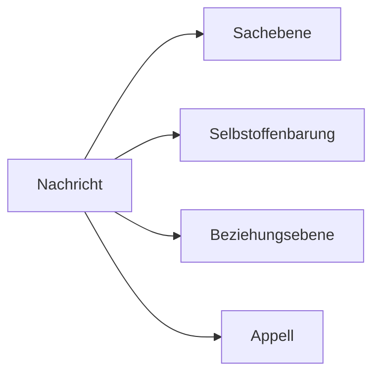

---
# Identity (stable; never change after publishing)
id: ap1-0143
slug: vier-ohren-modell-kundenkommunikation

# Display
title: Vier-Ohren-Modell in der Kundenkommunikation

# Classification / navigation (machine-side)
module: "Informieren und Beraten von Kunden und Kundinnen"
topics: ["Kommunikation", "Kundenkommunikation"]
tags: ["definition", "prüfungsrelevant"]

# Flashcard payload
card:
  type: multi
  question: "Ergänze nach dem Vier-Ohren-Modell (Sachebene, Appell, Selbstoffenbarung und Beziehung) die folgenden Aussagen eines Kunden gegenüber eines Vertriebsmitarbeiters."
  answer: |
    1. Sie müssen pünktlich liefern! → Appell
    2. Ich bin mit Ihnen nicht zufrieden. → Beziehung
    3. Sie haben nicht pünktlich geliefert. → Sachebene
    4. Ich kontrolliere Ihre Leistungen sehr genau. → Selbstoffenbarung
  examples: []

# Lifecycle
status: published
created: "2026-03-10"
updated: "2026-03-10"
---

## Vier-Ohren-Modell in der Kundenkommunikation

Das **Vier-Ohren-Modell** (auch **Vier-Seiten-Modell**) von **Friedemann Schulz von Thun** beschreibt, dass jede Nachricht **vier verschiedene Botschaften gleichzeitig enthalten kann**.

Diese vier Ebenen sind:

1. **Sachebene**
2. **Selbstoffenbarung**
3. **Beziehungsebene**
4. **Appell**

In der **Kundenkommunikation** hilft das Modell dabei, **Aussagen richtig zu interpretieren und Missverständnisse zu vermeiden**.

## Die vier Ebenen der Kommunikation

| Ebene | Bedeutung | Beispiel |
|---|---|---|
| Sachebene | reine Information oder Fakten | „Die Lieferung ist zu spät angekommen.“ |
| Selbstoffenbarung | was der Sprecher über sich selbst preisgibt | „Ich kontrolliere Ihre Leistungen sehr genau.“ |
| Beziehungsebene | wie der Sprecher zum Gesprächspartner steht | „Ich bin mit Ihnen nicht zufrieden.“ |
| Appell | was der Sprecher erreichen möchte | „Sie müssen pünktlich liefern!“ |

## Beispielanalyse der Kundenaussagen

| Aussage | Ebene |
|---|---|
| Sie müssen pünktlich liefern! | Appell |
| Ich bin mit Ihnen nicht zufrieden. | Beziehung |
| Sie haben nicht pünktlich geliefert. | Sachebene |
| Ich kontrolliere Ihre Leistungen sehr genau. | Selbstoffenbarung |

## Kommunikationsmodell

Eine einzige Aussage kann **gleichzeitig auf allen vier Ebenen interpretiert werden**.

## Bedeutung im Kundenkontakt

Im Vertrieb oder Support hilft das Modell dabei:

- **Kundenbeschwerden besser zu verstehen**
- **Missverständnisse zu vermeiden**
- **angemessen auf Kundenreaktionen zu reagieren**
- **professionell zu kommunizieren**

## Prüfungsrelevanz (AP1)

Typische Aufgaben:

- Aussagen einer **Kommunikationsebene zuordnen**
- die **vier Ebenen des Modells nennen**
- Beispiele interpretieren

## Merksatz

> **Jede Nachricht hat vier Seiten: Sache, Selbstoffenbarung, Beziehung und Appell.**

## Häufige Prüfungsfalle

| Fehler | Korrektur |
|---|---|Kurzüberblick
| Eine Aussage gehört nur zu einer Ebene | In der Praxis können **alle vier Ebenen gleichzeitig vorhanden sein** |
| Beziehungsebene = Emotion | Sie beschreibt **die Haltung zum Gesprächspartner** |
| Selbstoffenbarung = persönliches Geheimnis | Es geht allgemein darum, **was der Sprecher über sich selbst zeigt** |