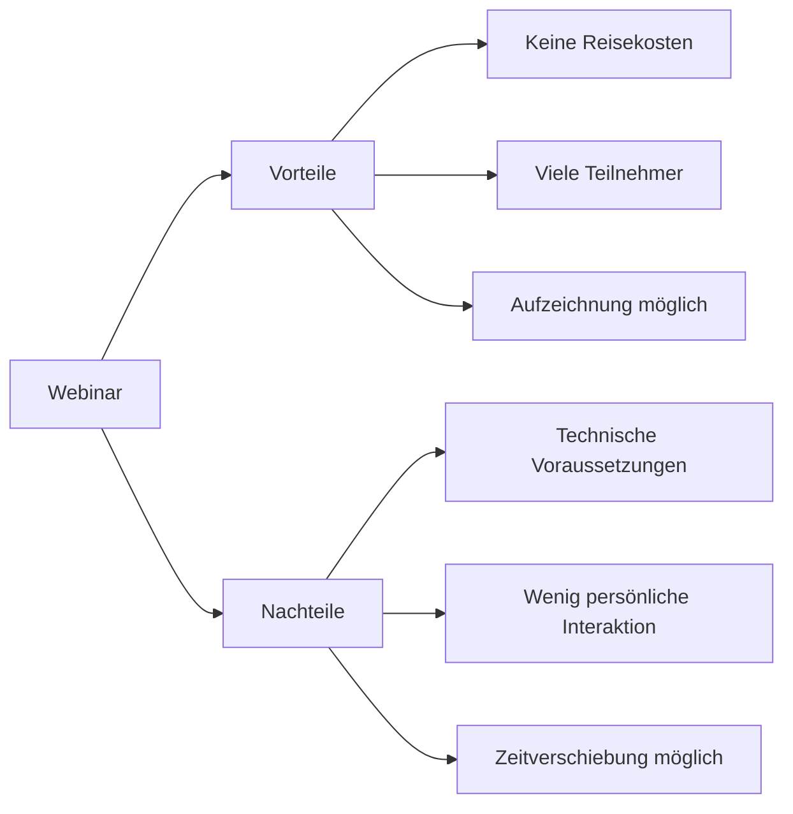

---
# Identity (stable; never change after publishing)
id: ap1-0146
slug: webinar-vor-und-nachteile

# Display
title: Vor- und Nachteile von Webinaren

# Classification / navigation (machine-side)
module: "Informieren und Beraten von Kunden und Kundinnen"
topics: ["Vertrieb", "Kundenberatung", "Online-Schulung"]
tags: ["prüfungsrelevant", "vergleich"]

# Flashcard payload
card:
  type: comparison
  question: "Welche Vor- und Nachteile bieten Webinare?"
  answer: |
    Vorteile:
    - Es entstehen keine Reisekosten.
    - Kurse sind individuell und kurzfristig planbar.
    - Eine große Anzahl an Teilnehmern kann erreicht werden.
    - Die Trainingsumgebung kann an Bedürfnisse angepasst werden.
    - Webinare können aufgezeichnet und später erneut angesehen werden.

    Nachteile:
    - Funktionierende technische Ausstattung und stabile Internetverbindung sind notwendig.
    - Praxisbezogene Übungen sind nicht immer leicht umzusetzen.
    - Die Stimmung und Reaktionen der Teilnehmer sind schwerer zu erkennen.
    - Es gibt keine gemeinsamen Aktivitäten der Teilnehmer (z. B. Pausen oder Gespräche).
    - Zeitverschiebungen können zu ungünstigen Webinarzeiten führen.
  examples:
    - "Eine Firma schult internationale Mitarbeiter über ein Webinar."
    - "Ein Softwareanbieter erklärt neue Funktionen über eine Online-Schulung."

# Lifecycle
status: published
created: "2026-03-10"
updated: "2026-03-10"
---

## Vor- und Nachteile von Webinaren

**Webinare** sind **Online-Schulungen oder Präsentationen**, die über das Internet durchgeführt werden.  
Sie werden häufig für **Schulungen, Produktvorstellungen oder Kundeninformationen** genutzt.

## Vorteile von Webinaren

| Vorteil | Erklärung |
|---|---|
| Keine Reisekosten | Teilnehmer können von überall teilnehmen |
| Flexible Planung | Kurse lassen sich kurzfristig organisieren |
| Viele Teilnehmer | Große Zielgruppen sind erreichbar |
| Anpassbare Trainingsumgebung | Inhalte können leicht angepasst werden |
| Aufzeichnung möglich | Inhalte können später erneut angesehen werden |

## Nachteile von Webinaren

| Nachteil | Erklärung |
|---|---|
| Technische Voraussetzungen | Internet und funktionierende Technik sind notwendig |
| Weniger Praxisübungen | Praktische Übungen sind schwerer umzusetzen |
| Weniger persönliche Interaktion | Stimmung und Reaktionen sind schwer erkennbar |
| Keine gemeinsamen Aktivitäten | Kein persönlicher Austausch oder Pausen |
| Zeitverschiebung | Internationale Teilnehmer können ungünstige Zeiten haben |

## Prüfungsrelevanz (AP1)

Typische Aufgabenstellung:

> „Nennen Sie Vor- und Nachteile von Webinaren.“

Erwartet werden meistens **3–5 Punkte pro Seite**.

## Merkschema

**Vorteile → flexibel, günstig, viele Teilnehmer**  
**Nachteile → Technik, weniger persönliche Interaktion**

## Vereinfachte Darstellung

