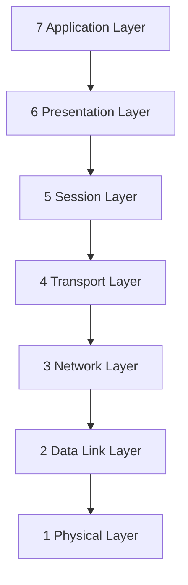

---
# Identity (stable; never change after publishing)
id: ap1-0147
slug: osi-modell-schichten-englisch

# Display
title: OSI-Modell – englische Bezeichnungen der Schichten

# Classification / navigation (machine-side)
module: "Informieren und Beraten von Kunden und Kundinnen"
topics: ["OSI", "Netzwerkmodelle"]
tags: ["prüfungsrelevant", "grundlagen"]

# Flashcard payload
card:
  type: basic
  question: "Wie lauten die englischen Bezeichnungen der einzelnen Schichten im OSI-Referenzmodell?"
  answer: |
    7 – Application Layer  
    6 – Presentation Layer  
    5 – Session Layer  
    4 – Transport Layer  
    3 – Network Layer  
    2 – Data Link Layer  
    1 – Physical Layer
  examples:
    - "HTTP arbeitet auf der Application Layer."
    - "TCP gehört zur Transport Layer."

# Lifecycle
status: published
created: "2026-03-10"
updated: "2026-03-10"
---

## OSI-Modell – englische Bezeichnungen der Schichten

Das **OSI-Referenzmodell (Open Systems Interconnection)** beschreibt die Kommunikation in Netzwerken in **7 Schichten**.  
Jede Schicht hat eine bestimmte Aufgabe bei der Datenübertragung.

## OSI-Schichten (Deutsch → Englisch)

| Layer | Deutsch | Englisch |
|---|---|---|
| 7 | Anwendungsschicht | Application Layer |
| 6 | Darstellungsschicht | Presentation Layer |
| 5 | Sitzungsschicht | Session Layer |
| 4 | Transportschicht | Transport Layer |
| 3 | Vermittlungsschicht | Network Layer |
| 2 | Sicherungsschicht | Data Link Layer |
| 1 | Bitübertragungsschicht | Physical Layer |

## Merksatz (für die Prüfung)

Von **Layer 7 → 1**:

> **Application – Presentation – Session – Transport – Network – Data Link – Physical**

Beliebte deutsche Eselsbrücke:

> **Alle Deutschen Studenten Trinken Verschiedene Sorten Bier**

## Vereinfachte Darstellung

## Prüfungsrelevanz (AP1)

Typische Aufgaben:

- englische Namen der **OSI-Schichten nennen**
- **deutsche ↔ englische Bezeichnung zuordnen**
- Reihenfolge der Schichten kennen

Besonders wichtig zu merken:

- **Layer 4 → Transport**
- **Layer 3 → Network**
- **Layer 2 → Data Link**
- **Layer 1 → Physical**