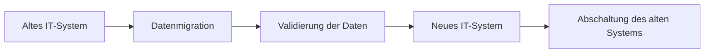

---
# Identity (stable; never change after publishing)
id: ap1-0152
slug: ausserbetriebnahme-it-systeme

# Display
title: Außerbetriebnahme von IT-Systemen

# Classification / navigation (machine-side)
module: "Informieren und Beraten von Kunden und Kundinnen"
topics: ["IT-Betrieb", "Systemmanagement"]
tags: ["prüfungsrelevant"]

# Flashcard payload
card:
  type: multi
  question: "Was ist bei der Außerbetriebnahme von IT-Systemen zu beachten?"
  answer: |
    Bei der Außerbetriebnahme von IT-Systemen sollten mehrere organisatorische und technische Punkte beachtet werden:

    - rechtzeitige Ankündigung der Maßnahme an Personal oder Kunden
    - Bereitstellung von Alternativ- und Backupsystemen
    - Datenarchivierung unter Beachtung der Datenschutz- und Aufbewahrungsfristen
    - mögliche Migration der Kundendaten auf ein neues IT-System
    - Schulung des Personals oder der Kunden bei Umstellung auf ein neues System
    - Validierung der migrierten Daten vor der Abschaltung des alten Systems
    - fachgerechte Vernichtung oder Entsorgung von Datenträgern (z. B. nach DoD-Standard)
    - fachgerechte Entsorgung oder Wiederaufbereitung der IT-Hardware
  examples:
    - "Vor der Abschaltung eines Servers werden alle Daten auf ein neues System migriert."
    - "Festplatten werden nach einem Sicherheitsstandard gelöscht oder zerstört."

# Lifecycle
status: published
created: "2026-03-10"
updated: "2026-03-10"
---

## Außerbetriebnahme von IT-Systemen

Die **Außerbetriebnahme eines IT-Systems** bedeutet, dass ein bestehendes System dauerhaft abgeschaltet und durch ein anderes System ersetzt oder vollständig stillgelegt wird.

Dabei müssen **technische, organisatorische und rechtliche Anforderungen** berücksichtigt werden.

## Wichtige Maßnahmen

| Bereich | Maßnahme |
|---|---|
| Kommunikation | frühzeitige Information von Mitarbeitenden oder Kunden |
| Datensicherung | Backup- und Alternativsysteme bereitstellen |
| Datenmanagement | Daten archivieren oder auf neues System migrieren |
| Schulung | Nutzer auf neue Systeme vorbereiten |
| Prüfung | migrierte Daten validieren |
| Sicherheit | Datenträger sicher löschen oder vernichten |
| Hardware | Geräte fachgerecht entsorgen oder wiederverwenden |

## Bedeutung der Datenmigration

Wenn ein neues IT-System eingeführt wird, müssen vorhandene Daten häufig **migriert** werden.

## Datenschutz und Sicherheit

Besonders wichtig ist der **sichere Umgang mit Datenträgern**.

Beispiele:

- zertifizierte Datenlöschung  
- physische Vernichtung von Festplatten  
- Einhaltung gesetzlicher **Aufbewahrungsfristen**

## Prüfungsrelevanz (AP1)

Typische Prüfungsfrage:

> „Was ist bei der Außerbetriebnahme von IT-Systemen zu beachten?“

Erwartet wird meist eine **Aufzählung mehrerer Maßnahmen** wie:

- Information der Nutzer  
- Backup / Migration  
- Archivierung  
- sichere Datenlöschung  
- Entsorgung der Hardware

## Merksatz

> **Außerbetriebnahme = informieren, sichern, migrieren, prüfen und Daten sicher entsorgen.**