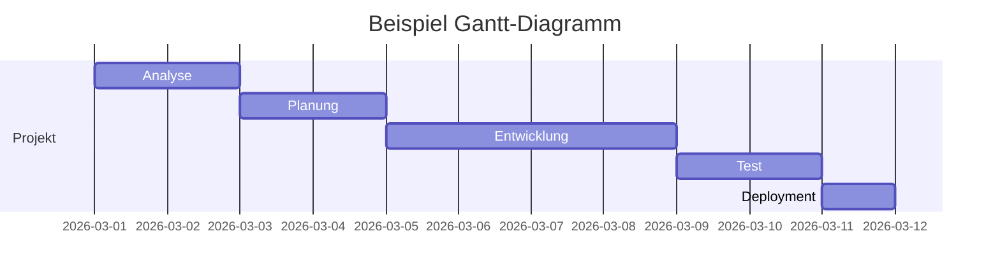

---
# Identity (stable; never change after publishing)
id: ap1-0104
slug: gantt-diagramm

# Display
title: Gantt-Diagramm

# Classification / navigation (machine-side)
module: "Plannen,Vorbereiten und Durchführen von Arbeitsaufgaben"
topics: ["Projektplanung", "Gantt-Diagramm"]
tags: ["prüfungsrelevant", "definition", "planung"]

# Flashcard payload
card:
  type: definition
  question: "Beschreibe den Begriff Gantt-Diagramm."
  answer: |
    Ein **Gantt-Diagramm** ist ein Werkzeug zur **Zeitplanung und Überwachung von Projekten**.

    Dabei werden **alle Projektaktivitäten entlang einer Zeitachse dargestellt**.  
    Jede Aktivität wird als **horizontaler Balken** dargestellt, dessen Länge die **Dauer der Aufgabe** zeigt.

    Dadurch lassen sich:
    - **Start- und Endzeitpunkte von Aufgaben**
    - **Dauer von Aktivitäten**
    - **überlappende Aufgaben**
    - **Abhängigkeiten zwischen Aufgaben**

    übersichtlich visualisieren.
  examples:
    - "Zeitliche Planung der Phasen Analyse, Entwicklung, Test und Deployment eines Softwareprojekts."
    - "Darstellung des Projektfortschritts bei der Einführung eines neuen IT-Systems."

# Lifecycle
status: published
created: "2026-03-10"
updated: "2026-03-10"
---

## Gantt-Diagramm

Das **Gantt-Diagramm** ist eines der wichtigsten Werkzeuge im Projektmanagement zur **Darstellung von Projektabläufen auf einer Zeitachse**.

Es zeigt:

- **welche Aufgaben existieren**
- **wann sie beginnen**
- **wie lange sie dauern**
- **welche Aufgaben parallel laufen**

Dadurch wird der **Projektverlauf visuell sehr leicht verständlich**.

## Aufbau eines Gantt-Diagramms

| Element | Bedeutung |
|---|---|
| Zeitachse | Horizontale Achse mit Zeit (Tage, Wochen, Monate) |
| Aktivitäten | Aufgaben oder Arbeitsschritte im Projekt |
| Balken | Zeigt Dauer einer Aktivität |
| Pfeile | Stellen Abhängigkeiten zwischen Aufgaben dar |

## Vorteile

| Vorteil | Erklärung |
|---|---|
| Übersichtliche Darstellung | Aktivitäten und Zeitplanung sind leicht erkennbar |
| Gute Visualisierung | Besonders geeignet für kleine und mittlere Projekte |
| Fortschrittskontrolle | Projektfortschritt kann leicht überwacht werden |

## Nachteile

| Nachteil | Erklärung |
|---|---|
| Bei großen Projekten unübersichtlich | Sehr viele Aktivitäten machen das Diagramm schwer lesbar |
| Abhängigkeiten nicht immer klar | Netzpläne zeigen logische Abhängigkeiten oft besser |

## Beispiel aus der IT

Projekt: **Einführung eines neuen Helpdesk-Systems**

| Aufgabe | Dauer |
|---|---|
| Analyse | 2 Tage |
| Planung | 2 Tage |
| Installation | 3 Tage |
| Test | 2 Tage |
| Schulung | 1 Tag |

Im Gantt-Diagramm erkennt man sofort:

- welche Schritte **nacheinander** erfolgen
- welche **parallel** möglich sind
- wie lange das **gesamte Projekt dauert**

## Prüfungsrelevanz (AP1)

Typische Prüfungsfragen:

- „Was ist ein Gantt-Diagramm?“
- „Wozu dient ein Gantt-Diagramm?“
- „Welche Vorteile und Nachteile hat ein Gantt-Diagramm?“

Wichtige Stichworte für die Antwort:

- Zeitachse
- Balkendiagramm
- Darstellung von Aktivitäten
- Dauer, Beginn und Ende von Aufgaben

## Häufige Fehler

| Fehler | Erklärung |
|---|---|
| Gantt-Diagramm mit Netzplan verwechseln | Netzplan zeigt Abhängigkeiten stärker |
| Balken falsch interpretieren | Länge des Balkens entspricht der Dauer |
| Zeitachse vergessen | Die Zeitachse ist das zentrale Element |