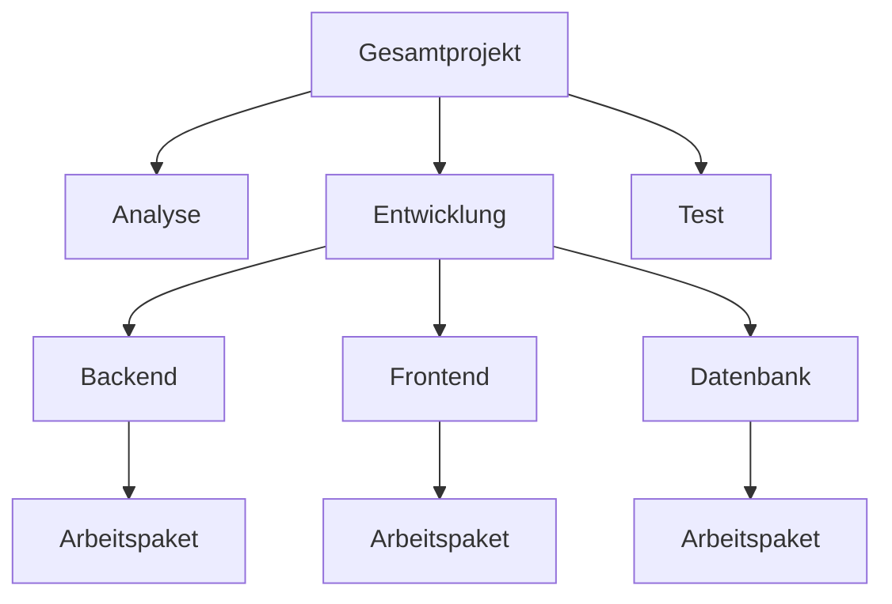

---
# Identity (stable; never change after publishing)
id: ap1-0105
slug: top-down-ansatz-projektstrukturplan

# Display
title: Top-Down-Ansatz beim Projektstrukturplan

# Classification / navigation (machine-side)
module: "Plannen,Vorbereiten und Durchführen von Arbeitsaufgaben"
topics: ["Projektstrukturplan", "Planungsmethoden"]
tags: ["prüfungsrelevant", "definition", "psp"]

# Flashcard payload
card:
  type: definition
  question: "Wie definiert man den Top-Down-Ansatz beim Projektstrukturplan?"
  answer: |
    Der **Top-Down-Ansatz** ist eine Methode zur Erstellung eines **Projektstrukturplans (PSP)**.

    Dabei wird das **Gesamtprojekt schrittweise vom Allgemeinen zum Detail zerlegt**.  
    Das Projekt wird zunächst als Ganzes betrachtet und anschließend in **Teilprojekte, Teilaufgaben und Arbeitspakete** untergliedert.

    Ziel ist es, die **gesamte Projektstruktur übersichtlich darzustellen**, bis alle **konkreten Arbeitspakete definiert sind**.
  examples:
    - "Ein IT-Projekt wird zuerst in die Hauptphasen Analyse, Entwicklung, Test und Deployment unterteilt."
    - "Die Phase Entwicklung wird anschließend weiter in Backend, Frontend und Datenbank aufgeteilt."

# Lifecycle
status: published
created: "2026-03-10"
updated: "2026-03-10"
---

## Top-Down-Ansatz beim Projektstrukturplan

Der **Top-Down-Ansatz** ist eine typische Methode zur Erstellung eines **Projektstrukturplans (PSP)**.  
Dabei wird ein Projekt **vom Gesamtziel ausgehend schrittweise in kleinere Teilaufgaben zerlegt**.

Man beginnt also **mit dem großen Ganzen** und arbeitet sich **systematisch zu detaillierten Arbeitspaketen** vor.

## Vorgehensweise beim Top-Down-Ansatz

Typische Schritte:

1. **Benennung des Gesamtprojekts**
2. **Zerlegung des Projekts in Teilprojekte oder Hauptphasen**
3. **Benennung der Teilaufgaben**
4. **Weitere Zerlegung der Aufgaben**
5. **Definition konkreter Arbeitspakete**

Das Ergebnis ist ein **hierarchisch strukturierter Projektstrukturplan**.

## Ziel des Ansatzes

Der Top-Down-Ansatz sorgt dafür, dass:

- das **Projekt vollständig strukturiert wird**
- **alle Teilaufgaben sichtbar werden**
- klare **Arbeitspakete für die Umsetzung** entstehen

## Wann wird der Top-Down-Ansatz verwendet?

Der Ansatz eignet sich besonders, wenn:

- bereits **Erfahrung mit ähnlichen Projekten** besteht
- die **Projektstruktur gut bekannt ist**
- das Projekt **klar definierte Hauptphasen** besitzt

## Beispiel aus der IT

Projekt: **Einführung eines neuen CRM-Systems**

| Ebene | Beispiel |
|---|---|
| Gesamtprojekt | Einführung CRM |
| Teilprojekt | Analyse |
| Teilprojekt | Implementierung |
| Teilaufgabe | Datenmigration |
| Arbeitspaket | Import der Kundendaten |

## Prüfungsrelevanz (AP1)

Typische Prüfungsfragen:

- „Was ist der Top-Down-Ansatz?“
- „Wie funktioniert der Top-Down-Ansatz im Projektstrukturplan?“

Wichtige Stichworte:

- vom **Gesamtprojekt zum Detail**
- **Zerlegung in Teilaufgaben**
- **Arbeitspakete**
- **hierarchische Struktur**

## Häufige Fehler

| Fehler | Erklärung |
|---|---|
| Top-Down mit Bottom-Up verwechseln | Top-Down beginnt beim Gesamtprojekt |
| Arbeitspakete zu früh definieren | Erst Struktur, dann Detail |
| Hierarchie nicht beachten | PSP ist immer hierarchisch aufgebaut |