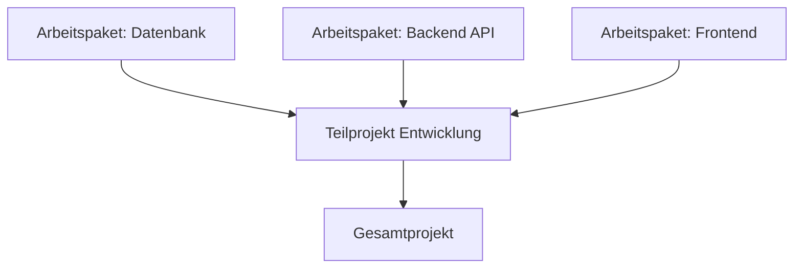

---
# Identity (stable; never change after publishing)
id: ap1-0106
slug: bottom-up-ansatz-projektstrukturplan

# Display
title: Bottom-Up-Ansatz beim Projektstrukturplan

# Classification / navigation (machine-side)
module: "Plannen,Vorbereiten und Durchführen von Arbeitsaufgaben"
topics: ["Projektstrukturplan", "Planungsmethoden"]
tags: ["prüfungsrelevant", "definition", "psp"]

# Flashcard payload
card:
  type: definition
  question: "Was versteht man unter dem Begriff Bottom-Up-Ansatz beim Projektstrukturplan?"
  answer: |
    Der **Bottom-Up-Ansatz** ist eine Methode zur Erstellung eines **Projektstrukturplans (PSP)**.

    Dabei wird das Projekt **vom Detail zum Gesamtprojekt aufgebaut**.  
    Zuerst werden **konkrete Teilaufgaben oder Arbeitspakete definiert**, die anschließend zu **größeren Teilprojekten und schließlich zum Gesamtprojekt zusammengeführt werden**.

    Ziel ist es, aus bekannten oder detaillierten Aufgaben eine **vollständige Projektstruktur aufzubauen**.
  examples:
    - "Ein Team definiert zuerst konkrete Aufgaben wie Datenbank einrichten, API entwickeln und Frontend erstellen und fasst diese anschließend zur Phase Entwicklung zusammen."
    - "Ein Projekt wird aus einzelnen Arbeitspaketen schrittweise zu Teilprojekten und schließlich zum Gesamtprojekt zusammengesetzt."

# Lifecycle
status: published
created: "2026-03-10"
updated: "2026-03-10"
---

## Bottom-Up-Ansatz beim Projektstrukturplan

Der **Bottom-Up-Ansatz** ist eine Methode zur Erstellung eines **Projektstrukturplans (PSP)**, bei der man **mit detaillierten Aufgaben beginnt** und diese schrittweise zu einer **Gesamtstruktur des Projekts zusammenführt**.

Im Gegensatz zum **Top-Down-Ansatz** startet man **nicht beim Gesamtprojekt**, sondern bei den **kleinsten bekannten Arbeitsschritten**.

## Vorgehensweise beim Bottom-Up-Ansatz

Typische Schritte:

1. **Festlegung der auszuführenden Aufgaben**
2. **Definition einzelner Arbeitspakete**
3. **Klärung der Beziehungen zwischen den Teilaufgaben**
4. **Zusammenfassung zu größeren Teilprojekten**
5. **Zusammenführung zum Gesamtprojekt**

## Ziel des Ansatzes

Der Bottom-Up-Ansatz sorgt dafür, dass:

- **alle konkreten Aufgaben berücksichtigt werden**
- **eine vollständige Projektstruktur entsteht**
- **Detailwissen aus dem Team genutzt wird**

## Wann wird der Bottom-Up-Ansatz verwendet?

Der Ansatz eignet sich besonders, wenn:

- **neue oder innovative Projekte** geplant werden
- das Projekt **noch keine klare Gesamtstruktur besitzt**
- viele **Detailinformationen bereits bekannt sind**

## Beispiel aus der IT

Projekt: **Entwicklung einer Webanwendung**

| Ebene | Beispiel |
|---|---|
| Arbeitspaket | Datenbank entwerfen |
| Arbeitspaket | API programmieren |
| Arbeitspaket | Benutzeroberfläche entwickeln |
| Teilprojekt | Backend |
| Gesamtprojekt | Webanwendung entwickeln |

## Prüfungsrelevanz (AP1)

Typische Prüfungsfragen:

- „Was ist der Bottom-Up-Ansatz?“
- „Worin unterscheidet sich Top-Down und Bottom-Up?“

Wichtige Stichworte:

- **vom Detail zum Ganzen**
- **Arbeitspakete zuerst**
- **Zusammenführung zu Teilprojekten**
- **Projektstruktur entsteht aus Aufgaben**

## Häufige Fehler

| Fehler | Erklärung |
|---|---|
| Bottom-Up mit Top-Down verwechseln | Bottom-Up startet bei den **Details** |
| Arbeitspakete nicht zusammenführen | Struktur entsteht erst durch Gruppierung |
| Reihenfolge falsch verstehen | Erst Aufgaben → dann Teilprojekte → dann Gesamtprojekt |